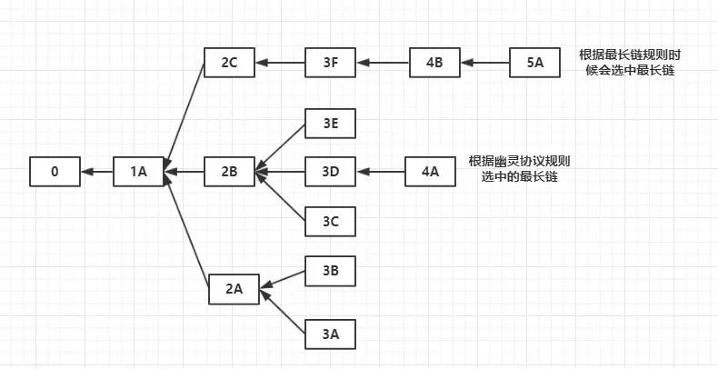

1. 基本了解了ｂｉｔｘｈｕｂ的工作机制，以及 collator如何配合ｂｉｔｘｈｕｂ的

2. 看完了精通比特币

   - 关键概念：ＵＴＸＯ

     交易如何使得比特币区块链状态进行转移的：一个Ｉｎ总是已经存在的一个ＵＴＸＯ的引用

     如何保证ＵＴＸＯ的正确使用：使用锁定脚本和解锁脚本，锁定脚本相当于包含了一个数学难题，锁定脚本包含的是用户的私钥，能够通过执行简单的堆栈脚本语言进行验证一个新的交易的ＩＮ是否合法

   - 多重签名和Ｐ２ＳＨ：多重签名应用在联合账户中，对于一个m个私钥控制的ＵＴＸＯ，可以自行确定至少需要 n 个私钥就能合法使用这个ＵＴＸＯ。

     但是多重签名有一个缺点就是：每个要发送到一个多重签名的账户的交易来说，在锁定脚本中要放置 m 个私钥对应的公钥。这样对于要转账的人来说很不方便，而且会加重区块链的通信成本和上链成本。所以可以通过把这 m 个私钥的进行哈希得到一个脚本地址，作为一个输入的地址。只要在

   - 共识机制

     如何解决在不同节点中会产生分叉的情况

     通过比较分叉的区块链中不同链上总的难度值之和（表明了在这条连上话费的工作量），始终选择难度值最大的那一条链当做主链，一般来说分叉不会超过一个区块

3. 以太坊

   看以太坊中出现的问题

   - ＭＰＴ的概念

     比特币中使用的是ＭＴ（默克尔树），能够解决集中校验的效果，以太坊中采用的是ＭＰＴ，结合了前缀树和ＭＴ的优点。

     - 前缀树

     - 默克尔证明

   - 共识机制

     目前的打算是：前三个阶段采用ＰＯＷ，到第四个阶段采用ＰＯＳ证明的方式

     目前挖取区块的奖励是：５个以太币＋该区块中的Ｇａｓ价格总和　＋　叔区块的价值的 1/32 ＝ 0.15625 个以太币

     * 如何解决分叉的问题

       ＧＯＡＳＴ协议

       

       以太坊中选择最长区块链的方法和比特币中的不同，但是以太坊中还需要解决的问题是“叔块”——３Ｅ和３Ｃ这两个区块。

     * 那什么又是ＰＯＳ共识机制

       共识就是要决定所有节点对于哪条区块链作为整个系统的主链的共识。

       ＰＯＳ机制中有一个股份的概念：对于一个代币系统可以是每个节点的代币数目（这里就是以太币）作为股份的多少，看哪条链作为主链就是看这条链被多少个节点认可（通过他们的总股份）来决定

       如何是结合具体应用的区块链这个股份的概念是可以改变的（比如一个在区块链追踪物流的公司），可以通过物流的价值来作为股份。

     * 其他共识机制？

       ＥＯＳ的ＤＰＯＳ机制——下次了解

       还有ＲＢＦＴ算法