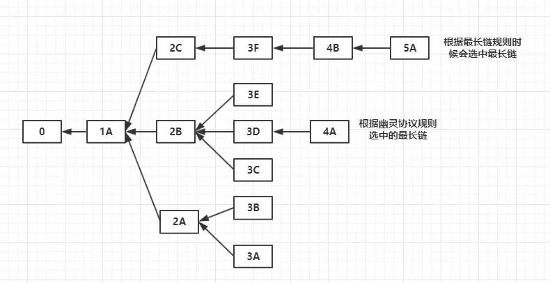

1. 基本了解了ｂｉｔｘｈｕｂ的工作机制，以及 collator如何配合ｂｉｔｘｈｕｂ的

2. 看完了精通比特币

   - 关键概念：ＵＴＸＯ

     交易如何使得比特币区块链状态进行转移的：一个Ｉｎ总是已经存在的一个ＵＴＸＯ的引用

     如何保证ＵＴＸＯ的正确使用：使用锁定脚本和解锁脚本，锁定脚本相当于包含了一个数学难题，锁定脚本包含的是用户的私钥，能够通过执行简单的堆栈脚本语言进行验证一个新的交易的ＩＮ是否合法

   - 多重签名和Ｐ２ＳＨ：多重签名应用在联合账户中，对于一个m个私钥控制的ＵＴＸＯ，可以自行确定至少需要 n 个私钥就能合法使用这个ＵＴＸＯ。

     但是多重签名有一个缺点就是：每个要发送到一个多重签名的账户的交易来说，在锁定脚本中要放置 m 个私钥对应的公钥。这样对于要转账的人来说很不方便，而且会加重区块链的通信成本和上链成本。所以可以通过把这 m 个私钥的进行哈希得到一个脚本地址，作为一个输入的地址。只要在

   - 共识机制

     如何解决在不同节点中会产生分叉的情况

     通过比较分叉的区块链中不同链上总的难度值之和（表明了在这条连上话费的工作量），始终选择难度值最大的那一条链当做主链，一般来说分叉不会超过一个区块

3. 以太坊

   看以太坊中出现的问题

   - ＭＰＴ的概念

     比特币中使用的是ＭＴ（默克尔树），能够解决集中校验的效果，以太坊中采用的是ＭＰＴ，结合了前缀树和ＭＴ的优点。

     - 前缀树

     - 默克尔证明

   - 共识机制

     目前的打算是：前三个阶段采用ＰＯＷ，到第四个阶段采用ＰＯＳ证明的方式

     前沿（Frontier），家园（Homestead），大都会（Metropolis）和宁静（Serenity）。中间的硬分叉代号为“冰河时代（Ice Age）”，“DAO”，“蜜桔前哨（Tangerine Whistle）”，“假龙（Spurious Dragon）”，“拜占庭（Byzantium）”和“君士坦丁堡（Constantinople）”。

     现在处于大都会阶段

     目前挖取区块的奖励是：５个以太币＋该区块中的Ｇａｓ价格总和　＋　叔区块的价值的 1/32 ＝ 0.15625 个以太币

     * 如何解决分叉的问题

       ＧＯＡＳＴ协议

       

       以太坊中选择最长区块链的方法和比特币中的不同，但是以太坊中还需要解决的问题是“叔块”——３Ｅ和３Ｃ这两个区块。

     * 那什么又是ＰＯＳ共识机制

       共识就是要决定所有节点对于哪条区块链作为整个系统的主链的共识。

       ＰＯＳ机制中有一个股份的概念：对于一个代币系统可以是每个节点的代币数目（这里就是以太币）作为股份的多少，看哪条链作为主链就是看这条链被多少个节点认可（通过他们的总股份）来决定

       如何是结合具体应用的区块链这个股份的概念是可以改变的（比如一个在区块链追踪物流的公司），可以通过物流的价值来作为股份。

     * 其他共识机制？

       ＥＯＳ的ＤＰＯＳ机制

       通过持有代币的节点在每次产生区块之前选举产生一个生产者（产出区块的节点），并且如果生产者错过了一个区块，并且 24 小时内没有再生产区块，那就会被淘汰。

       还有ＲＢＦＴ算法

   - EVM虚拟机

     对应于比特币中的锁定脚本和解锁脚本这种简陋的栈语言脚本，以太坊支持了图灵完备的虚拟机，用来执行任意的代码。**所以意思就是任何执行了一个合约内部代码的合约就能拿到这个合约给出的回馈。**

     > 听到以太坊是图灵完备的，但是其实在这样一个分布式系统中，图灵完备也许不是一个好事。比特币设计的脚本是非图灵完备的，所以可以预测到脚本语言一定是有限时间执行的，相反在ＥＶＭ中运行的代码无法预测什么时候停机，这也给只能合约带来了麻烦。
     >
     > 为了克服这个麻烦，引进了Ｇａｓ系统，使得无限运行的智能合约无法承受这么高的代价而停机

     所有人都可以在以太坊上部署自己的合约，并获得一个合约地址

   - 密码学基础

     大素数对：给定两个大素数的乘积，很难找出是哪两个素数

     椭圆曲线算法（ＥＤＣＳＡ）

     Keccak-256是一个单向哈希函数，用于从公钥中产生一个以太坊的地址（哈希之后的低位２０字节作为地址）

   - 交易

     以太坊中采用的是ＲＬＰ对于网络传输的交易进行编码的

     这种方式的编码比较精简，易于实现，不同与ｐｒｏｔｏｂｕｆ之类的实现

     ```go
     type Tx struct {
         nounce int64 // 防止消息重播的随机数
         gasPrice int64 // 发送方愿意给出的gas价格
         startGas int64 //愿意支付的最大gas量
         to []byte //目标以太坊地址
         value int64 //发送到目标地址的ether数量
         data []byte //变长二进制数据
         v,r,s []byte // ECDSA签名的三个组成部分
     }
     ```

     1. `from` 字段是不存在的，因为可以通过 `v,r,s` 这三个字段得出公钥，在通过哈希得到发送方的地址

     2. nounce 用于标明这个合约已经发出的交易的最高序号。这种机制用来对抗“多重支付的问题”，在比特币中，采用的是时间戳再加上ＵＴＸＯ只能唯一被消费的ＰＯＷ证明来保证不会有多重支付。

        以太坊的nouce 字段很重要，但是对于并发性来说是一个很大的挑战，多个节点下如何实现nouce 的协调很难。

     3. 离线签名

        就是将签名过程和传输签名好的交易放在不同的计算设备中。因为签名需要使用私钥，传输交易需要链接网络，两个功能由同一个计算机完成的话，非常危险

        当然这种隔离可以是物理上的，也可以是逻辑上的（防火墙、沙盒）

   - 智能合约

     智能合约就是一个计算机程序，但是会有一系列的特点

     * 不可变

       在链上部署之后，不能再改变代码。要改变只能部署新的合约

     * 结果确定

       只能根据ＥＶＭ的上下文信息和自己的代码进行有限的执行

   - Ｓｏｌｉｄｉｔｙ语言

     到底什么业务场景才是适合智能合约的呢？

     我觉得是需要信任的业务场景，而且普通的要获取一致性的信任的成本往往是很大的，所以在区块链上做这个就可能会节省很多建立信任的成本。