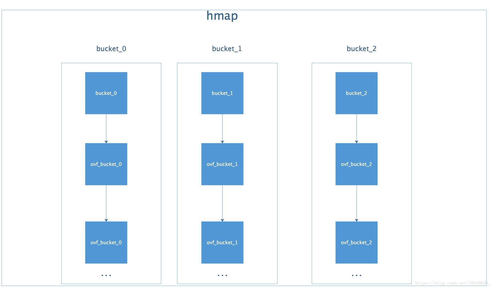

1. 协程

   Go 语言的协程是一个很精髓的东西，值得深入的学习

   每个 goroutine (协程) 默认占用内存远比 Java 、C 的线程少。

   goroutine：*2KB*  　　　　线程：8MB

   线程/goroutine 切换开销方面，goroutine 远比线程小 

   *线程：*涉及模式切换(从用户态切换到内核态)、16个寄存器、PC、SP...等寄存器的刷新等。

   *goroutine：*只有三个寄存器的值修改 - PC / SP / DX.

   * 简单的协程

     ```go
     import "fmt"
     
     func test() {
         for i := 0; i< 10; i++ {
             go fmt.Println(add(i, i+1))
         }
     }
     func add(a int, b int) int {
         return a + b
     }
     ```

     go 关键字可以创建一个协程，很简单

     一个物理处理器对应一个ＯＳ级别的线程，一个ＯＳ级别的线程可以有一个队列的协程，而且协程的调度是在Ｇｏ语言层面的，不会触发ＯＳ级别线程的切换

     但是这样的写法会有问题，就是同步的问题。协程是异步执行的，所以可能在主程序执行完毕之后，协程还没执行完，这时候会强制退出。

     要达到同步的目的，需要使用`sync` 或者是　`channel` 

   * channel 同步

     ```go
     c1 := maek(chan int)
     c2 := chan int
     // 不带缓冲
     c3 := make(chan int, 10)
     // 在缓冲填满之前都不会阻塞
     for i := 0; i< 10; i++ {
         c1 <- i// 每填充一个数就阻塞，直到其他的goroutine取出
     }
     ```

     channel 是有带缓冲和不带缓冲的两种

     ```go
     select {
         case <- chan1:
         // 如果chan1成功读到数据
          
         case chan2 <- 1:
         // 如果成功向chan2写入数据
      
         default:
         // 默认分支
     }
     // select 如果没有ｃｈａｎｎｅｌ准备好是默认阻塞的，如果有多个ｃｈａｎｎｅｌ准备好，随机选择一个执行
     // 要小心　select 无限阻塞，因为一直没有准备好的ｃｈａｎｎｅｌ，就会一直阻塞，不会结束。所以一般都会有一个　context.Done()函数作为外部结束的一个判断
     ```

   * ｃｈａｎｎｅｌ底层的实现是怎么样的？

   * ｃｈａｎｎｅｌ在ｃｌｏｓｅ之后还能读取吗？

     明确一点就是：可以在关闭之后继续读取，但是不能写入或者再次关闭。

     ｃｈａｎｎｅｌ在关闭之后再去关闭就会ｐａｎｉｃ，但是没有内置的方法判断一个ｃｈａｎｎｅｌ的状态

     ```go
     func IsClosed(ch <-chan T) bool {
     	select {
     	case <-ch:
     		return true
     	default:
     	}
     
     	return false
     }
     
     func main() {
     	c := make(chan T)
     	fmt.Println(IsClosed(c)) // false
     	close(c)
     	fmt.Println(IsClosed(c)) // true
         // 另外一种简单的判断方法
         value, ok := <- ch
     }
     ```

     

   * 协程泄露

     1. ｃｈａｎｎｅｌ中有数据没有被读取，也没有被显式的关闭的时候，就会发生泄露，一个协程在永远的阻塞等待
     2. ｃｈａｎｎｅｌ没有写入

     解决的一般方法是：在需要主动使用ｃｈａｎｎｅｌ的线程中，加入一个done通道，作为开启那个协程的函数的输入。在主线程完成工作之后，就可以通过这个ｄｏｎｅ通道通知到其他的协程了。

2. map

   Ｇｏ语言底层是用一个散列表进行实现的

   

   注意：

   map[key] 只是得到key对应的值，但是无法进行取址操作。

   `map[string]struct` 这样的ｍａｐ中无法对于map[key].name之类的成员进行修改

   `map[string]*struct` 所以一般这样写，就能进行修改了

   map 不是线程安全的，所以需要加锁

   检测map中的键值是否存在

   ```go
   if _, ok := x["two"]; !ok {
       fmt.Println("key two is no entry")
   }
   // 正确做法
   x["two"] 如果"two"不存在的话，会返回对应key-value中value的默认类型
   ```

   map 扩容之后的操作是什么？

3. 传递指针和引用

   很多时候传指针是比较好的选择

4. Ｇｏ反射机制的开销如何？

5. 熟悉ＤＨＴ（Ｐ２Ｐ网络相关的）

6. ｈｙｐｅｒｃｈａｉｎ到底是一个怎样的系统

7. 精通ｃｏｓｍｏｓ

8. 尝试看一看ｌｅｖｅｌｄｂ的源代码

9. 区块链系统的信任是建立在什么上面的？

10. ＩＰＦＳ怎么做的？

11. 