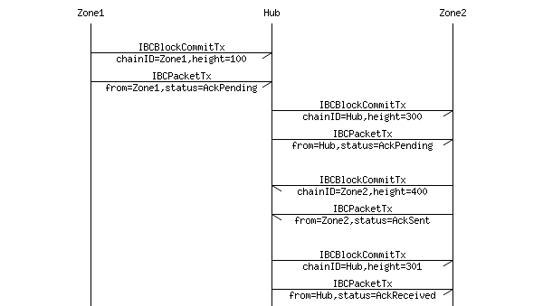
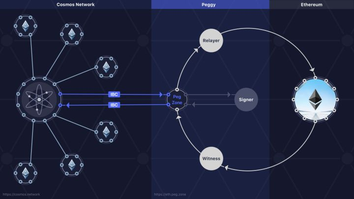

1. cosmos 的ＩＢＣ技术

   就是一种应用层的ＴＣＰ连接

   

   用于跨链的两种结构

   * IBCBlockCommitTx：发送方所在区块链的最新的区块信息。

     > An `IBCBlockCommitTx` transaction is composed of:
     >
     > * `ChainID (string)`: The ID of the blockchain
     > * `BlockHash ([]byte)`: The block-hash bytes, the Merkle root which includes the app-hash
     > * `BlockPartsHeader (PartSetHeader)`: The block part-set header bytes, only needed to verify vote signatures
     > * `BlockHeight (int)`: The height of the commit
     > * `BlockRound (int)`: The round of the commit
     > * `Commit ([]Vote)`: The >⅔ Tendermint `Precommit` votes that comprise a block commit
     > * `ValidatorsHash ([]byte)`: A Merkle-tree root hash of the new validator set
     > * `ValidatorsHashProof (SimpleProof)`: A SimpleTree Merkle-proof for proving the `ValidatorsHash` against the `BlockHash`
     > * `AppHash ([]byte)`: A IAVLTree Merkle-tree root hash of the application state
     > * `AppHashProof (SimpleProof)`: A SimpleTree Merkle-proof for proving the `AppHash` against the `BlockHash`

   * IBCPacketTx：跨链交易本身的信息，及其在发送方链中被打包的区块信息。

     > An `IBCPacket` is composed of:
     >
     > * `Header (IBCPacketHeader)`: The packet header
     > * `Payload ([]byte)`: The bytes of the packet payload. *Optional*
     > * `PayloadHash ([]byte)`: The hash for the bytes of the packet. *Optional*
     >
     > 其中，IBCPacketHeader　又有
     >
     > * `SrcChainID (string)`: The source blockchain ID
     > * `DstChainID (string)`: The destination blockchain ID
     > * `Number (int)`: A unique number for all packets
     > * `Status (enum)`: Can be one of `AckPending`, `AckSent`, `AckReceived`, `NoAck`, or `Timeout`
     > * `Type (string)`: The types are application-dependent. Cosmos reserves the "coin" packet type
     > * `MaxHeight (int)`: If status is not `NoAckWanted` or `AckReceived` by this height, status becomes `Timeout`. *Optional*

     **如何连接不确定性的区块链**

     witness 作为一个见证以太坊中交易最终确定性的装置，100 blocks之后抛出一个事件给Peggyzone,是一个以太坊的全节点。

     signer：用ether使用的签名算法对于交易签名

     Relayer：将cosmos中发过来的交易队列打包送到ether的智能合约中

     

     