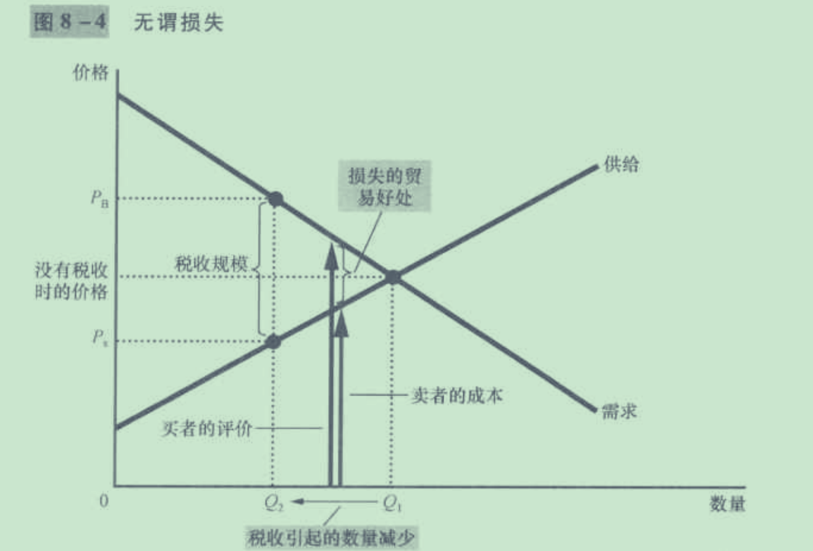

### 第一章

1. 经济学的十大原理

   经济学虽然是一门社会科学，但不要忘记这也是一门科学，他要通过严谨的推理得到合乎现实的结论，下面这些是经济学的基石，就像数学中的公理那样。

   人们如何做出决策

   * 人们面临取舍
   * 某种东西的成本是为了得到它所要放弃的东西
   * 理性人考虑边际量
   * 人们会对激励作出反应

   人们如何相互交易

   * 贸易可以使得每个人的状况变得更好
   * 市场通常是组织经济活动的一种好的方法
   * 政府有时可以改善市场结果

   整体的经济运行是怎样的

   * 一国的生活水平取决于该国的生产物品和劳务的能力
   * 当政府发行了过多的货币时，会产生通货膨胀
   * 社会面临通货膨胀和失业之间的短期权衡

### 第二章

1. 要想经济学家一样思考问题

   社会学家研究经济运行的规律的时候并不是凭空想出来的，也是想经典学科那样通过观察，总结，然后验证的过程。

   传闻牛顿在被一个苹果砸到脑袋之后，想到了是什么力量使得苹果落到地上，之后他想出了外有引力定律。我想要是一个经济学家生活在一个政府无节制的印发钞票的国家，他大概也会想为什么物价飞涨，也许会想到是不是钞票的印发引起的。接下来他会去验证自己的想法，但是社会学家的比较困难的一点就在这里，他们 不可能像自然科学家一样在实验室第几个实验球来验证自己的理论。社会学家只能充分利用历史发生的经济事件来验证。如果一次又一次的历史验证了这个理论，我想大概他就可以发表论文说明自己的理论了。

2. 假设的重要性

   就像要问物理学家我们在10M高的屋顶扔下石块，要多长的时间落地，物理学家大概会告诉你假设在真空情况下的时间，如果要考虑空气阻力的话，大概物理学家也不能解答你的问题。但是这种假设既对于石块的下落几乎没有影响，又能很好的简化问题。社会学的研究也一样，他们会做出很多的假设，为了让解释这个世界更加的容易。

   同样假设也是有条件的，要在不会影响大体结果的情况下才是一个好的假设。就像如果计算一个气球从10M落下的时间，你大概不会认为假设为真空的条件不会对结果产生什么影响。一个合理的假设是经济学家很重要的研究部分。、

3. 模型的重要性

   我们早就知道模型是自然科学家有力的武器，更好的表述自己的理论，更清晰的逻辑关系。经济学家也一样，也需要面对很多的公式和模型，这些模型能够很好的加深我们对于这个世界的理解。

4. 第一个模型——循环流量图

   

   这个模型说明了生产要素和资金在社会中的流动方向，这在考虑经济中各个部分如何组合在一起的时候很重要。

5. 生产可能边界模型

   这是我们学习的第一个数学经济模型，

   

   我们假设社会上只有两种产品——电脑和汽车（x轴表示汽车，y轴表示电脑）。

   A、E两个点表示的是我们社会资源能够承受的范围内能够制造出最多的汽车或者汽车的数量。B、C、D所在的那条线就是生产可能边界线。**这根线说明了经济学原理的第一条——社会面临取舍**。在这条线上移动，我们或者减少电脑的生产，或者减少汽车，约束是我们社会的资源总量，生产技术等等。

   在弧线以内的点比如H是一种无效率的结果，这收往往是社会的失业率偏高等等导致的，如果消除了社会无效率的因素，我们就既能增加电脑的产量又能增加汽车的产量。

   曲线的斜率也是一种很有用的信息，比如在C点的斜率（绝对值）是2，那么这个表明在这种状态下通过减少生产2台电脑来换取一辆汽车的生产。这反映的是另一条经济学原理——**某种东西的成本是为了得到它所要放弃的东西** 。

   经济学家认为生产可能边界一般都是这种凹向原点的状态。这是因为在大规模生产电脑的边界区域，意味着会有一部分熟练的汽车工人转移到生产电脑，但是这种转移造成的就是效率的降低，汽车熟练工的生产效率在电脑时会降低，所以在接近两端的极限状态（只生产电脑或者汽车），会变得陡峭——需要更多的汽车生产（电脑生产）换取一台电脑。

   **生产边界的移动** 。在生产技术升级这种原因的情况下，曲线会进行移动。比如制作工艺进步使得电脑生产工人一周上产的量增加，会产生下面的图像——图像整体上移，但是汽车生产的边界点不会移动。

   

6. 作为经济顾问的经济学家

   作为顾问身份的经济学家，一般都会做出“一方面.......另一方面”的论断，好像他们说完之后对于政策的判断并没有什么作用。请理解经济学家的难处，经济学原理的第一条——人们面临取舍——决定了他们的提议也是面临取舍的。

   我们很可能会遇到经济对于同一政策做出不同（甚至相反）的判断，请理解这种情况的发生，不仅仅是科学判断的不同，经济学家本身的价值观也会影响判断。

## 相互依存和贸易的好处

我们使用牧羊人和农民的经济寓言故事来讲述这一章的故事

> 设想世界上有两种物品——牛肉与土豆。而且世界上有两个人——牧牛人和种土豆的农民——他们每人都既喜爱吃牛肉，又喜爱吃土豆。
>
> 如果牧牛人只能生产牛肉，而农民只能生产土豆，那么，贸易的好处是最明显的。在一个方案中，牧牛人和农民可能选择“老死不相往来”。但在吃了几个月烤牛肉、煮牛肉、炸牛肉和烧牛肉之后，牧牛人确认自给自足并不像想像的那样惬意。一直吃土豆泥、炸土豆、烤土豆和用贝壳烘的土豆的农民也同意牧牛人的看法。很容易看出，贸易使他们能享用更多的种类：这时每个人都可以有汉堡包和炸薯条。
>
> 虽然这个故事最简单明了地说明了每个人如何能从贸易中获益，但如果牧牛人和农民都能生产对方的物品，只是要以相当高的成本，这种好处也是类似的。例如，假定种土豆的农民可以养牛并生产牛肉，但他并不擅长于养牛。同样，假定牧牛人也能种土豆，但他的土地并不适于种土豆。在这种情况下，很容易看到，农民和牧牛人都可以专门从事自己最擅长的活动，然后在相互交易中获益。
>
> 但是，当一个人在生产每一种物品上都较为擅长时，贸易的好处就不太明显了；例如，假定牧牛人在养牛和种土豆上都优于农民。在这种情况下，牧牛人和农民应该选择保持自给自足吗？或者还有什么理由使他们相互交易？为了回答这个问题，我们需要进一步考察影响这类决策的因素。

假定，农民用15分钟生产1盎司土豆，用60分钟生产1盎司牛肉。牧牛人在这两种活动中的生产率都较高，用10分钟生产1盎司土豆，20分钟生产1盎司牛肉。假设农民和牧牛人每人每天工作8小时，并且可以把这个时间用于种土豆、养牛或两者的组合上。经过权衡取舍，他们各花一半时间在两种活动中。在这种情况下会发生自发的贸易活动吗？我们画一下两个人的生产可能边界图可以更加清晰的分析。

> 在吃用了几年各自不相往来之后，牧牛人有了个主意，并与农民交谈：
>
> 牧牛人：农民啊，我的朋友，我想和你谈点儿事！我知道如何改善我们的生活。我认为你应该完全停止生产牛肉，并把你所有的时间用于种植土豆。根据我的计算，如果你一周工作40小时种植土豆，你将生产4磅土豆。如果你把这4磅土豆中的1磅给我，我给你3磅牛肉作为回报。最后，你每周将能吃到3磅土豆和3磅牛肉，而不是你现在得到的2磅土豆和1磅牛肉。如果你按我的计划去做，你将有更多的这两种食物。[为了说明自己的观点，牧牛人向农民展示了图（a）幅。］
>
> 农民：（声音显得有些怀疑）听起来对我是个好交易。但我不明白为什么你提出了这个交易。如果交易对我这么好，不能对你也有好处吧。
>
> 牧牛人：啊！可它对我是有好处的、如果我每周用24小时养牛，16小时种土豆，我将生产24磅牛肉和2磅土豆。我给你3磅牛肉来交换1磅土豆以后，我将有21磅牛肉和3磅土豆。最后，我将得到的这两种食物都比现在多。[他指着图（b）幅]。
>
> 农民：我不知道……这听起来太棒了，真令人难以相信。
>
> 牧牛人：实际上这并不像乍看起来那么复杂。这儿，我用一个简单的表概括了我向你提的建议。（牧牛人递给农民表3－2的复印件。）
>
> 农民：（停下来研究该表之后）这些计算看来是正确的，但我总有点弄不明白。这种交易怎么能使我们两人都过得更好呢？
>
> 牧牛人：我们两人都可以获益是因为贸易使我们每个人可以专门从事我们最擅长的工作。你将把更多的时间用于种土豆．更少的时间用于养牛。我将把更多的时间用于养牛，更少的时间用于种土豆。由于专业化和贸易，我们每个人都可以不用再增加工作时间而消费更多的牛肉和更多的土豆。
>
> 

可以看出来这次的交易是可以达成的，但是为什么不让更专业的人（牧羊人）从事某项活动，最终达到的效果还是更优呢？下面要引入几个专业术语进行解释。

1. 绝对优势、机会成本、比较优势

    > 绝对优势：当比较一个人，一个企业或一个国家与另一个人、另一个企业或另一个国家的生产率时，经济学家用了绝对优势这个术语。生产者生产一种物品所需要的投入量较少，就可以说该生产者在生产这种物品中有绝对优势。

    > 根据经济学的一条原理——某种东西的成本是为了得到它所要放弃的东西，我们把这种东西叫做机会成本

   当牧羊人想要多生产一盎司的牛肉的时候，就得放弃4盎司的土豆，这就是生产牛肉的机会成本。同理其他的。

|      | 牛肉（根据放弃的土豆） | 土豆（根据放弃的牛肉） |
| ---- | ----------- | ----------- |
| 农民   | 4           | 1/4         |
| 牧牛人  | 2           | 1/2         |

> 如果同样生产一样东西，一方的机会成本更低，这叫该方在这样东西的生产上有比较优势。

​	比如上面的牧羊人在生产牛肉上比农民有比较优势，农民在生产土豆上有比较优势。

机会成本和比较优势的差别引起了贸易的好处。当每个人专门生产自己有比较优势的物品时，经济的总产量就增加了，而且，经济蛋糕规模的这种扩大可以使每个人的状况更好。换句话说，只要两个人有不同的机会成本，每个人都可以通过以低于自己生产时的机会成本的价格得到一种物品，而从贸易中获益。

最后可以得出我们这一个故事的结论

> 贸易可以使社会上每个人都获益，是因为它使人们可以专门从事他们具有比较优势的活动。

## 供给和需求的市场力量

1. 市场：市场是某种物品或劳务的一群买者与卖者。

2. 在本章中我们假设,市场是完全竞争的。可以根据两个基本特征来定义完全竞争市场：

   （1）所提供销售的物品是完全相同的。

   （2）买者和卖者如此之多，以至于没有一个买者或卖者可以影响市场价格。由于完全竞争市场上的买者与卖者必须  接受市场决定的价格，所以，他们被称为价格接受者。

3. 需求定理：其他条件相同时，一种物品价格上升，该物品需求量减少；一种物品价格下降，该物品需求量增多。

   由此我们也可以得出一个需求曲线：人们对于某种东西的需求量随着价格的变化曲线。

4. 需求曲线的移动

   在某一因素改变了某一价格下的需求量，需求曲线就会移动。比如大规模的失业、某种商品被证明有益处之类的。

   影响买者的一些重要变量

   * 收入。当大家的收入水平下降的时候，向冰激凌之类的**正常物品**需求量会下降，但是也有一些属于**低档物品**，比如坐公交车
   * 相关物品的价格。如果冰激凌的需求增加，往往奶昔的需求量也会增加，因为奶昔和冰激凌大部分时候是一起吃的。类似的还有电脑和软件，汽油和汽车。这一类的相关称为**互补品**。还有另外一种情况的相关就是**替代品**，比如冷冻酸奶和冰激凌，一种物品的需求量的上升很可能会导致另一种的下降。
   * 嗜好。这样很容易理解，一个人对于某种物品有嗜好，自然会多买这种物品，造成这种物品需求量的上升。但是经济学家往往不愿意考虑这种超越经济学范围研究的历史和心理原因。但是很多时候研究嗜好的变化会造成什么印象还是很有必要的。
   * 预期。如果人们对于这种物品有降价的预期，自然会降低这种物品这种物品现阶段的需求量。、
   * 买者的数量。这个也很直观。

5. 供给曲线

   价格和供给量之间的关系称为供给曲线。和需求定理对应的还有供给定理：在其他条件相同时，一种物品价格上升，该物品供给量就增加。

   影响供给的重要因素：

   * 投入品的价格。按照冰激凌来说明，如果只做冰激凌的奶油、糖、工人费下降，生产冰激凌就会变得更加有利可图，就会刺激冰激凌的生产。
   * 技术。技术可以提高生产效率，利润增加。
   * 预期。对于市场需求的预期下降，相应供给量也会下降
   * 卖者数量。很明显的关系。

6. 供给和需求的结合

   供给曲线和需求曲线的交点称为市场的**均衡**，改点的价格称为**均衡价格**，相应的数量叫做**均衡数量**。

   物品需求量超过了供给量，存在物品短缺；物品需求量少于了供给量，存在物品的过剩。

   > 供求定理：任何一种物品价格的调整都会使该物品的供给与需求达到平衡。

7. 分析均衡变动的三个步骤

   * 分析一个事件影响的是供给曲线还是需求曲线。
   * 对于曲线的移动方向是怎么影响的
   * 按照供求图进行分析

## 弹性及其应用

如果汽油的价格上涨，你会预见到开车的人会减少，但是你如果想知道到底会有多少的人减少开车呢，上一章的知识可能无法回答我们，我们需要弹性的概念来回答。

### 需求弹性

需求价格弹性反应的是需求量对于价格的反应程度的一个量

1. 弹性的定义和计算

   需求价格弹性=需求量变动的百分比 / 价格变动的百分比。如果一样东西的需求量对于价格反应强烈，我们叫这种商品是富有弹性的，反之是缺乏弹性的。

2. 弹性的影响因素

   * 相近替代品的可获得性
   * 必需品和奢侈品：奢侈品对于价格的反应比较大，必须品不大

从一种商品的需求曲线中我们可以求得它的弹性大小，有一个重要特征是**需求曲线是一条直线的商品，它的弹性并不是定值** 。

#### 总收益和需求价格弹性

总收益是需求曲线上一点的坐标值（需求量，价格）和坐标轴围成的矩形的面积值。而且总收益对于销量的变化情况和需求曲线的斜率是息息相关的。

在一条需求曲线上的移动情况

如果曲线斜率< 1，表示因为价格因素造成的需求量上升会使得总收益上升。如果曲线斜率>1，表示因为价格变动造成的需求量的上升会使得总收益下降。

一条呈现直线的需求曲线上，弹性的变化状态

3. 其他的弹性

   * 需求收入弹性：衡量消费者收入变动时需求如何变动的参数

     需求收入贪心=需求量变动百分比  / 收入变动百分比

   * 需求的交叉价格弹性——衡量一种物品的价格变动对于另一种物品需求量的影响

     需求的交叉价格弹性 = 物品1 需求量变动百分比 / 物品2的价格变动百分比

     这种弹性系数的正负表示的是两种物品是替代品还是互补品

### 供给弹性

基本上和需求弹性的定义和使用差不多	

### 弹性思想的简单应用

1. 现在假设农业部门研制出了一种更加的高产的小麦，你认为这个对于农业进步的消息对于一位农民来说是一个好消息吗？

   要分析这种问题，我们需要分析事件对于供需曲线的影响。很明显我们能够知道单位亩产的升高，意味着农民的单位成本下降了，农民愿意在任一既定的价格下提供更多的小麦（也就是供给曲线右移），但是需求曲线不移动。我们可以想到供给的平衡点，需求量上升，但是价格下降了。现在我们更关心的是农民收入有没有增多呢？

   这取决于小麦子这种物品的需求弹性了，容易知道小麦是一种需求弹性很小的物品，所以销量的上升反而意味着总收益的下降。一件对于农业是一件好事的消息对于农民来说却并不怎么好。

   这也能解释为什么农业效率不断提升的今天，从事农业的人越来越少了，这因该算是农业越来越无利可图的市场作用结果。

## 供给、需求、与政府政策

这一章主要讲述的是我们的政府政策会对于社会经济造成怎样的影响，这也是激动人心的一章，我们主要是紧紧抓住分析供求这一有力的工具。

### 价格控制

市场中的价格是供需平衡的结果，但是如果政府进行干预，指定价格上限或者价格下限，市场就会产生很有趣的现象。

* 价格上限

假设一个市场上售卖冰激凌，市场调节的价格是3美元。

如果政府受到冰激凌消费者的劝说，制定了价格上限4美元，这时候明显不会对于市场造成什么影响。

但是如果制定价格上限2美元，这个时候冰激凌售卖者受到市场的刺激，随着冰激凌价格上升，增加产量到“2美元下他们愿意生产的最多冰激凌数量”比如说75个，这时候虽然还有更多的需求150个但是2美元的上限让他们没有动力去生产，这时候会有物品短缺，就会产生新的物品分配的机制，比如说消费者排长队购买，虽然买到冰激凌的消费者得到了价格更低的冰激凌，但是这也意味着有75位消费者没有买到冰激凌。

从这里我们可以得到一般性的结论：**当政府对竞争市场实行限制性价格上限时，就产生了物品的短缺，而且，卖者必然在大量潜在买者中配给稀缺物品。这种价格上限之下产生的配给机制很少是合意的。排长队是无效率的，因为这样做浪费了买者的时间。根据卖者偏好的歧视既无效率（因为物品并没有给予对它评价最高的买者）又可能是不公正的。与此相比，一个自由竞争市场中的配给机制既有效率又客观。当冰激凌市场达到均衡时，任何一个想支付市场价格的人都可以得到一个冰激凌蛋卷。自由市场用价格来配给物品。** 

观察一个很经典的问题：城市房屋出租价格上限控制

为了使得穷人能够住得起廉价的出租房，政府吧价格限制字啊一定水平。在这里短期的房屋出租市场和长期的房屋出租市场是不一致的。

短期内，出租房的数量变化不大，同样需要租房的人也是变化不大，也就是说租房的供给和需求弹性很差。在短期内确实能够起到降低价格的好处，引起的短缺不大。

但是在长期市场中，租金上限中，房东做出的反应是少新建租用房，不修缮租用房。租房者做出的反应是多使用租房，而不是和别人同住，或者在父母家中住。但是像所有的价格上限的作用一样，房屋出租必定是短缺的，这就造成了租房者必须花费更多的时间找房子，而且房东可以有自己的房屋分配制度，把房子租给自己更加青睐的房客。而且缺少价格对于房东的激励，反动更倾向于不改善自己房子的居住状况，因为有足够多的房客需要租房。所以造成的结果是人们用更低的价格租到了居住环境更差的房子，还有很大部分的人租不到房子。

所以有一位经济学家说过：除了炸弹之外，设定价格上限是毁灭一座城市最有效的方法。

* 价格下限

价格下限的作用和上限相反，造成了物品的供给过剩。

最经典的例子就是制定最低工资法：很有可能起到的效果并不是和预期的那样。最低工资直接影响不到工资在这之上的熟练工人，反而是那些技能不熟练的青少年很容易造成失业的问题。一方面企业不愿意提供这么高的工资给不熟练的工人，另一方面更高的工资刺激了青少年退学上班。

### 税收

如果我们要制定相关税收的措施，我们的明白税收到底是怎么分配到消费者和商人手中的，各一方又要负担多少比例？

**税收归宿**： 税收负担如何在组成市场的不同人之间分配

通过分析直接向卖者收税或者直接向买者收税的情况，我们得出结论：**通过市场的供需曲线的移动和平衡之后，税收都是买家和卖家共同分摊的** 。但是不一定是平均分担的，事实上这是由需求和供给曲线的弹性决定的。

**如果需求曲线的弹性比供给曲线的弹性要大，那么大部分的税收负担由供给侧的生产者承担；如果供给曲线的弹性比需求曲线的弹性大，那么大部分的税收负担由消费者负担。 结论就是税收更多的落在缺乏弹性的一方上**  

这也就指导我们再制定政策的时候，不需要去故意分配税收。

比如劳工法的分配税收的做法是徒劳的，因为劳动市场上劳动的需求比劳动的供给要有弹性（劳动供给者把工资作为生存的资料的一方），所以必定是工人更多的承担了税收。

奢侈品税早期是用来向富人征税税收的手段，但是经济税收的原理告诉我们实际情况并不是这样。比如对于制造游艇税，对于游艇的需求远比游艇的供给有弹性，因为富人可以轻易的把他们的钱用到更多的享受上去，但是游艇的制作商并不能很快的把制作游艇变动到其他商品上，所以最后市场上还是游艇制作方承担了大部分的税收，也就是最后工人来承担高额的奢侈品税，这反而和我们的预期相反。所以在1993年废除了大部分的奢侈品税。

## 市场和福利

在市场上消费者希望价格低一些，商人希望价格高一点，虽然价格在不同的曲线下总是会达到平衡的状态，但是是不是有两条曲线达到一个“正确的价格”，使得大部分的人都满意呢？这是**福利经济学** 研究的内容之一。

### 消费者剩余

**消费者剩余**概念 ：**消费者剩余**（consumer surplus）又称为**消费者**的净收益，是指**消费者**在购买一定数量的某种商品时愿意支付的最高总价格和实际支付的总价格之间的差额。

> 需求曲线之下和价格以上的部分衡量的是一个市场上的消费者剩余。

消费者剩余衡量的是消费者愿意为商品付出的最高价值量和实际价格的价值量的差值，所以这些差值的和能够表达消费者以实际购买价格买入时**自己感到的利益**， 能够很好的衡量经济福利的表征。

### 生产者剩余

同样转到生产者的一边，也有对应的衡量的生产者的福利的指标——生产者剩余。

概念时差不多的，自己进行体会即可

> 供给曲线之上和价格之下的部分面积表示的生产者剩余。

### 总剩余

总剩余 = 消费者剩余 + 生产者剩余   也就是

总剩余 = 买者的评价 - 买者支付的量 + 卖者得到的量 - 卖者的成本 = 买者的评价 - 卖者的成本

如果说资源配置就是为了使得总剩余最大，那么这种配置是一种有效率的配置。如果没有效率的配置，那么就会有的卖者或者买者的潜在利益没有实现。比如没有让生产成本最小的生产者进行生产，没有让对于物品评价最高的人进行消费，这样的配置是无效的。

我们可以通过计算得知在需求曲线和供给曲线的交点处的价格能够使得市场的总剩余最大，所以说自由市场的总是自发地向最有效率的地方移动，这也就是十大经济学原理中的——市场通常是组织经济活动的一种好的方法。

但是这样的市场是有几个前提条件才能实现的

* 市场总是完全竞争的。真实的市场往往不是完全竞争的，是存在市场势力，这些势力通常时市场失灵的导火索。
* 市场结果只是影响买者和卖者。市场也有时会影响到非卖者和非卖者，比如造成环境污染的产品。这种副作用称为外部性。

## 赋税的代价

赋税的过程会使得消费者的价格升高，生产真的价格降低，政府得到了额外的税收收入，我们比较供需曲线图就可以知道

总剩余（税后） + 税收收入 < 总剩余（税前）

所以说**卖者和买者因为税收而遭受的损失大于政府得到的税收收入**， 这部分呢多出来的损失叫做**无谓损失**。

回顾十大经济学原理，我们可以通过——人们会对激励做出反应——来解释。税收扭曲了激励，造成了配置的无效率。

而且我们可以明确知道这个损失的表征值，也就是下图中的一个小的三角形

根据这个小三角形的大小，我们可以衡量税收代价的大小，还可以分析得到下面的结论：

**供给和需求的弹性越大，税收的代价——无谓损失越大**

## 生产成本

什么才是一个企业的成本？一个会计可能只会记录公司的显性成本，但是一个经济学家需要考虑企业的隐性成本。比如BEN开了一家糕点店，它的显性成本就糕点的原料费用、支付的工人工资等等，但是如果BEN本身是一个出色的程序员，如果当一个全职的程序员，可能会有100美元每天的工资，这100美元就是一种机会成本，经济学家肯定需要考虑这种成本，因为这在某些情况下会严重影响到企业的决策。

**生产函数**： 生产量（比如糕点的个数）随投入量（比如工人数）的变化情况。

**总成本函数**： 总成本随投入量（比如工人数）的变化情况。

我们在考虑一个企业会生产多少东西的时候，往往不是看产品的平均成本是多少，而是考虑边际量——增加或减少一个工人造成的产量的增多或者减少。显示生活中经常会出现的是**边际产量递减** ——一种投入的边际产量随着投入量增加而减少的现象。

可以想象，边际成本是一种变化中体现的量，我们很自然的可以想象到函数的倒数可以表示边际成本的大小。

经常考虑的三个曲线是：平均总成本（ATC）、平均固定成本（AFC）、平均可变成本（AVC）、边际成本（MC）。

ATC：该曲线一般是呈现U字型的，在初始阶段，因为有规模效应，生产量越大，ATC越小。但是随着的生产量的增长，还是会暴露很多问题，使得单位产品的价格上升。对于这个的解释是：一开始规模较小的时候，增加人工数量，能够使的工人的工作更加的专业化，会大幅度的提高效率，这也是现代流水线生产的原理，每个人只需要熟练的掌握一个小环节的生产就行。但是随着规模的不断增大，管理的效率开始下降，内部进行协调的成本越来越高，专业化已经达到很细的程度，所以效率开始下降。

ATC的决定指：只要**边际成本**小于**边际收益**，ATC就会降低，而在完全竞争的市场上，**边际收益**及时市场上的价格，所以只需要得到边际成本的曲线就可以得到最小的ATC所对应的的生产量。

## 竞争市场中的企业

**我们假设市场上的所有企业的最终目标是使得利润最大化**，这对于一般的市场来说确实是受用的。

很重要的一个影响企业进行生产的应因素是边际成本，如果企业的边际成本小于边际收益——也就是市场价格的时候，企业就会进行生产。**在本质上，企业的边际成本曲线决定了企业在任意一种价格的时候意愿供给的物品数量，从这个意义上说，边际成本曲线就是供给曲线**，但是这个结论还是有一些前提限制的。我们会在下面进行说明。

#### 企业的暂时关停和退出市场

决定一个企业是否退出市场的量是**沉没成本** 

> 当一件成本发生而且无法收回的时候，这种成本叫做沉没成本

在短期的分析中，当一个企业面临收入紧张的时候，企业并不能够通过关停来收回成本（也就是沉没成本），所以这部分固定成本企业是可以不考虑的，**短期内，只要收益大于可变成本，企业就会维持下去**，这也是为什么看上很冷清的面馆也没有关门的原因。

在长期的分析中，企业需要考虑的是**收益和总成本的关系**，通过分析我们可以得到下面的结论：

>竞争企业的长期供给曲线是边际成本位于平均总成本之上的部分。

#### 长期由企业进入和退出的市场供给

我们假设是一个有竞争的市场环境，每一个人都可以获得生产一种产品的技术，并且可以进入一个市场购买生产投入品，进入和退出市场的激励是市场上的利润。如果企业在市场上有利可图，那么就会新的企业进入，进行生产，从而增加产量、提高供给，并使得价格下降，利润降低。同样如果市场的利润是亏损的话，企业就会推出，减少产量，价格增高，利润升高。所以**一个完全竞争的市场的情况是所有的企业都是零利润**。这听上去是一个荒诞的结论，但是我们应该想到经济学家所考虑的成本是包括机会成本的，时间、精力等等都考虑在内。所以企业的收入能够弥补因为运行企业带来的机会成本。所以一位企业家说自己的企业是“非盈利组织”并非戏言。

## 垄断

垄断产生的原因：垄断资源、政府赋予的垄断、自然垄断

垄断资源：某种资源掌握在个别人手中，经典的案例是南非的钻石公司，它掌握了80%的钻石矿产，市场份额只有10%，但是这个公司对于钻石价格还是有着巨大的影响。这种垄断资源的案例还是很少的。

政府创造的垄断：比如专利和版权，也可以说是政府为了激励人们进行创作的利益等于允许垄断的成本。

自然垄断：当某种物品的生产具有很强的规模效应，很容易产生自然垄断。具有较大规模的公司通过扩大规模降低ATC，从而达到比小规模的企业更低的成本，小企业在竞争中失利，退出市场，最终形成垄断。

垄断者的收益分析：

垄断者和竞争市场中的企业的区别是垄断的生产量就是市场的需求量——消费者别无选择。所以垄断者面临的需求曲线是一条斜向下的曲线，而有竞争的企业面临的需求曲线是一条平行于X轴产量的曲线——也就是一个企业的生产量不能左右整个市场的需求量（这里假设的是在一个特定的时刻，市场的需求量是不变的，而不是市场的需求量不会根据价格变化的意思）。垄断者生产越多，价格必须降低，从而**垄断者的边际收益是永远小于价格的，是一条斜向下的曲线，而且位于需求曲线的下方**  

那垄断企业会生产多少的物品才会停止呢？应该使得企业的成本最大化的一个生产量。结合图像我们可以知道，**垄断者的利润最大化是由边际收益曲线和边际成本曲线的交点决定的**。

总结出垄断市场和竞争企业的关键区别：

**在竞争市场上，价格等于边际成本；在垄断市场上，价格小于边际成本**

### 关于垄断的几种应对措施

既然垄断势力对于整体的社会福利来说是有害的，那么政府也可以对于垄断势力做出的管理措施。但是我们应该看到尽管采取了这些措施，也不能彻底消除垄断的影响，而且有些措施还会带来额外的坏处，这需要政策制定者作出权衡。

## 垄断竞争

前面的章节只是介绍了完全竞争和市场只有一个生产者的垄断情况。但是现实生活中更多应该还是垄断竞争。想象一个出版市场，感觉是任何一个人都可以通过写作和出版本书进入这个市场，但是每一个人写的书又是独一无二的，在某种程度出版者是有自己定价权的（也就是卖者是价格决定者，而不是接收者）。这样的情况既不符合竞争市场，也不是垄断市场，我们把这种模式称为垄断竞争模型。

前面描述的两种市场情况——完全竞争和垄断——都是市场的极端情况，更多时候市场是处于两者之间的——不完全竞争状态。

不完全竞争有可以分成两种——寡头模式和垄断竞争。

寡头模式是只有少数几个提供相似或者相同产品的卖者的市场结构。集中率用来描述市场结构——市场中最大的前四位企业在市场上生产量的占比。一般的市场中集中率在50%以下。

另一种就是垄断竞争，下面的几种特征用来描述垄断竞争的市场。

* 许多卖者：有许多企业竞争相同的顾客群体
* 产品差别：每个卖者生产的至少一种产品和其他企业略有不同，这就说明每个企业面临的需求曲线不是一条直线——市场价格，而是一条向右下倾斜的曲线。
* 自由进入和退出：这说明市场上的企业数量要调整到市场上无利可图为止。

