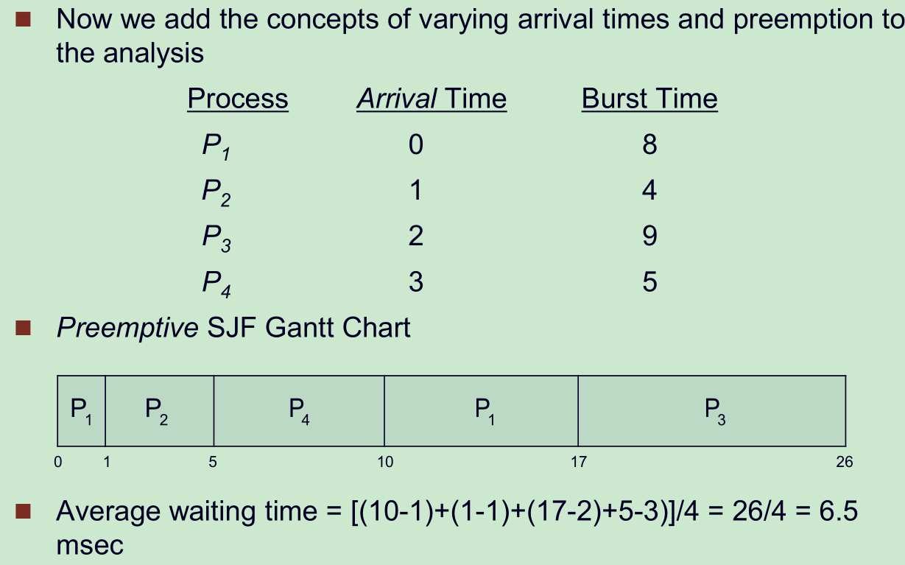

## 操作系统概念

1. 操作系统定义

   操作系统没有统一的定义，但是可以说操作系统是一个在电脑硬件和电脑用户之间的一个协调者。

2. 操作系统的作用

   * Control and coordinate the use of system resources (hardware and
     software)
   * Use the computer hardware in an efficient and protected manner
   * Make the computer system convenient to use for users (services)

3. 操作系统的分时系统

   CPU的运行速度远远快于IO或者其他的操作响应，所以串行执行任务会让CPU大部分时间处于空闲状态。让CPU在多任务之间进行切换，让用户觉得每一个任务都是在同时执行。

4. 运行模式

   为了把操作系统和一般的程序进行分离，操作系统会由两种运行状态，一种是user mode，另一种是kernel  mode。一些操作只能在kernel mode下执行（比如IO控制，timer，中断管理），如果在user mode 中需要用到kernel  mode下才能执行的功能，那可以调用system call进入kernel mode，从system call中返回时进入user mode。

5. timer作用

   * 保证OS拥有对于CPU的控制权
   * 防止用户的code进入infinite loop而不把控制权转还到OS。
   * user program在运行的的时候，timer就会启动，如果counter变成了0，就会产生一个中断，CPU控制权重新回到OS，OS把相应的program杀死。

6. 多处理器和单处理器计算机

   现代电脑基本都是多处理器，也叫并行或者多核系统，多个CPU公用总线，内存，时钟等，但是每一个处理器都有自己的register和cache。

   多处理器的优点：

   * 更大的吞吐量
   * 比多个单核计算机更加经济
   * 更可靠

   有两种不同的CPU组织方式，一种是不对称处理——boss-worker，另一种是对称处理。

7. 多核和计算机集群的比较

## 操作系统结构

* 系统服务

  

  ​

* 系统调用

* 系统软件

* 系统设计和实现

* 系统结构

* 虚拟机

## 系统进程

1. 什么是进程

   进程是进程实体的运行过程，是系统进行资源分配和调度的一个独立单位。

   1） 运行状态：进程正在处理器上运行。在单处理器的环境下，每一时刻最多只有一个进程处于运行状态。

   2） 就绪状态：进程已处于准备运行的状态，即进程获得了除CPU之外的一切所需资源，一旦得到处理器即可运行。

   3） 阻塞状态：又称为等待状态：进程正在等待某一事件而暂停运行，如等待某资源为可用（不包括处理器），或等待输入输出的完成。及时处理器空闲，该进程也不能运行。

   4） 创建状态：进程正在被创建，尚未转到就绪状态。创建进程通常需要多个步骤：首先申请一个空白的PCB，并向PCB中填写一些控制和管理进程的信息；然后由系统为该进程分配运行时所必须的资源；最后把该进程转入到就绪状态。

   5） 结束状态：进程正在从系统中消失，这可能是进程正常结束或其他原因中断退出运行。当进程需要结束运行时，系统首先必须置该进程为结束状态，然后再进一步处理资源释放和回收工作。

   注意区别就绪状态和等待状态：就绪状态是指进程仅缺少处理器，只要活得处理器资源就立即执行；而等待状态是指进程需要其他资源或等待某一事件，即使处理器空闲也不能运行。

2. 进程的挂起

   挂起这种特殊的状态，是指进程不在内存中的一种状态，当然有很多种情况都能转化为挂起

   * 进程阻塞：进程在等待某些资源的时候，OS认为进程可以先移出内存，这是阻塞导致的挂起
   * 就绪进程->挂起：进程已经是可以运行的状态，但是进程优先级比较低，OS有可能先把该进程移出内存。
   * 阻塞挂起->就绪挂起：一开始由于进程的阻塞进程移出了内存，之后虽然进程等待的资源已经准备好了，但是CPU还没有分配时间给该进程，该进程就从阻塞挂起变成了就绪挂起。

   进程状态转变：

   ​	

   进程在操作系统中的表示：PCB（Process Control Block）

   

   顺带提一下线程，线代OS一般都允许每一个进程中有多个线程，这样一个程序才能并发运行不同的任务。

   * 程序和进程的区别
     * 可以说进程不止于程序，一个程序可能只是作为一个部分出现在一个进程的text，code，process state
     * 有时候也可以说程序不止一个进程，一个程序可以多次调用形成多个进程。
     * 程序应该说是静态的（存在磁盘上的代码行），而进程是有life circle的，始终在某一个状态中。

3. 进程的特征，比如进程管理、启动、终止、通信

   * 进程管理

     任务队列（Job Queue）：系统所有的进程，是一个进程池

     Ready queue：在内存中准备执行的进程

     Device queues：在等待确定的IO设备的进程

     

     Long-term scheduler：任务调度，决定什么时候把什么进程放入ready queue/写入内存中，较少被调用。

     Short-term scheduler：CPU调度，决定ready queue 中哪个进程得到CPU的时间，经常被调用。The long-term scheduler controls the **degree of multiprogramming** - the number of processes that can concurrently be running in a system。

     Medium-term scheduler：为了降低系统并发执行进程的度，可以引入Medium-term scheduler的概念，它的主要工作是把内存中进程移除到磁盘上，需要时在调入内存，这个过程叫做**swapping**。

     在进程的转化过程，系统必须保留执行的现场，这种方式叫做**Context Switch**，Context Switch 的信息保存在进程的PCB中。需要保留的信息有程序计数器，寄存器，进程状态，内存管理的信息，打开的文件等等。进程的切换是比较好费时间的操作，而且很依赖于硬件的支持，比如有的硬件能够同时操作多个寄存器。

   * 进程的启动、生成、终止

     * 启动

       在Linux中调用fork()函数。

       操作系统会创建一个新的PCB给子进程（如果成功），把父进程的运行状态拷贝一份一模一样的，也就是说子进程的PCB中除了PID和父进程不一样，其余的一致。

       fork()函数的返回值

       

       进程生成之后的执行流程：

       

       ```c++
       int main()
       {
       	for (int i = 0; i < 10; i++)
       		if (fork())
       			fork();
       	return 0;
       }
       ```

       这段函数会生成$3^{10}$ 个进程（自己可以画出流程图思考一下）

     实际上fork() 函数的之后一般会采用exec() 函数，因为一般创建一个新的进程，不希望子进程和父进程一样，往往要完成不同的功能。考虑下面的代码

     ```c++
     int main() {
       pid_t pid = fork();
       if(pid == 0) {
         exec("calc.exe", "calc on");
         printf("Why am i being called?"); // won't be called
       }
       else {
         printf("process %d started", pid);
       }
     }
     ```

     上面的第五行的代码在正常情况下是不会执行的，因为exec()  执行之后会把调用的程序覆盖所在进程的信息，也就是原进程的指令都没有了。

     在实际系统中99%都是调用fork() 函数之后立即调用exec() 函数，所以一个很明显的问题就是如果进程的信息马上就会被覆盖，那为什么还要浪费资源copy一遍父进程。所以Linux 系统采用了两种fork() 函数，fork() 和vfork() 函数。

     fork() 和之前的功能一致，

     * vfork() 函数只是copy 父进程部分状态信息，是一个虚的fork() 过程
     * 之后一般需要马上调用exec() 函数才能继续执行
     * 采用copy on write (COW) 策略实现 fork() 函数，具体做法就是调用fork() 函数的时候不立即分配新的空间，只是copy 一份父进程的内存页表，如果在取址的时候发生异常，OS才把要访问的产生异常的内容一分为二，给父进程和子进程。这样如果子进程只是只读的话，可以很高效。

     ​

     * 终止进程

       进程的终止有多种情况

       * 进程执行完最后一行代码，请求OS来删除进程（内存，寄存器的使用权等），一般使用exit() 函数

       * 父进程可以终止子进程（abort()函数）

         * 子进程的资源已经被OS回收了

         * 子进程的任务被取消了

         * 父进程退出执行了

           不同的OS采取的策略可能不同，有的OS不允许子进程在父进程结束之后继续执行。但是有的OS允许，这就造成了子进程没有父进程，这样的进程称为“孤儿进程”，Linux和Unix把孤儿进程全部归到系统的**init**进程的子进程中。init进程会周期性的调用wait()来回收子进程的资源。

     * wait()函数的流程说明

       一般一个父进程调用了wait()这个系统函数，父进程会停止执行，等待某个特定（或者所有的子进程）执行退出。子进程exit()后，返回执行的状态码到OS，OS在把返回状态返回给父进程，父进程继续执行。

       如果父进程没有调用wait()函数，而这个时候子进程终止了（通俗讲就是子进程终止的消息没有被父进程接收到，子进程的入口和PID之类的还是存在于父进程的进程目录中），这个子进程就叫做zombie process。

4. IPC的两种方式

   * 共享内存

     不同的进程使用相同的内存地址，都可以调用read() 和write()这样的system calls。但是这样的策略在多核的时候很麻烦（每个核有自己的内存和缓存）。

   * 消息传递

     使用send() 、receive()这样的system calls。使用消息队列来保存管理消息。

     了解消息的队列在操作系统中的使用以及作用的流程。

5. C/S之间的通信

   * 通过网络通信，使用一对Socket

   * pipes

     通过操作系统的管道技术的实现了解一般的管道技术的原理。

## 多线程编程

1. 多线程的好处

   * 更快的响应速度。如果某一部分的程序block了，那么CPU可以转到其他部分执行，而不会卡死。
   * 资源的共享。一个进程的多个线程是默认共享进程的资源的，着对于进程之间通信来说是简化很多的，更加容易实现。
   * 更轻量级。线程的生成比起进程来说是资源消耗更少，也不会有context switch的困扰。
   * Scalability。能够更好的利用多核的机器，

2. 多进程编程的挑战性

   * 如何切分一个task为多个进程需要很好的设计
   * 数据的分配问题，怎么才是最小的耦合性

3. 并发和并行的区别

   并行是真正意义上的同时运行，多个核心执行不同的任务；并发只是不断的切换任务，并不是真正的同时。

4. Amdahl's Law （阿姆达尔定律）

   增加更多的处理器核心带来的速度提升比可以用下面的公式描述
   $$
   speedup = \frac{1}{S+\frac{(1-S)}{N}}
   $$
   其中S是描述程序中串行部分比例的一个百分数，N是总共的核数。

   比如一个应用程序75%是并行，25%串行，那么使用两个核心最多比一个核心要快1.6倍。

   如果$N\to \infty$，那么加速比趋近于$\frac{1}{S}$。

5. 线程的状态

   就像进程间一样，每一个线程都要维护一个状态信息，线程的状态信息就保存在TCB（Thread Control Table）中，包括下面的信息：

   * 执行的状态：CPU的寄存器、程序的计数器、堆栈的位置指针
   * 调度信息等等

6. 用户线程、核心线程

   * 核心线程

     * 内核线程又称为守护进程，内核线程的调度由内核负责，一个内核线程处于阻塞状态时不影响其他的内核线程，因为其是调度的基本单位。这与用户线程是不一样的；
     * 这些线程可以在全系统内进行资源的竞争；
     * 内核空间内为每一个内核支持线程设置了一个线程控制块（TCB），内核根据该控制块，感知线程的存在，并进行控制。在一定程度上类似于进程，只是创建、调度的开销要比进程小。有的统计是1：10。
     * 内核线程切换由内核控制，当线程进行切换的时候，由用户态转化为内核态。切换完毕要从内核态返回用户态，**即存在用户态和内核态之间的转换**，**比如多核cpu，还有win线程的实现**。

   * 用户线程

     用户线程一般是有runtime library支持的，最主要的的三个的线程库是

     ●POSIX Pthreads – POSIX standard (IEEE 1003.1c) define an API for thread creation and
     synchronization. Most UNIX-type systems such as Linux, Mac OS X, and Solaris.
     ● Win32 threads – Window thread library.
     ● Java thread – any system that provides a JVM such as Window, Linux, and Mac OS X.

     * 用户线程在用户空间中实现，内核并没有直接对用户线程进程调度，内核的调度对象和传统进程一样，还是进程（用户进程）本身，内核并不能看到用户线程，内核并不知道用户线程的存在。
     * 不需要内核支持而在用户程序中实现的线程，其不依赖于操作系统核心，应用进程利用线程库提供创建、同步、调度和管理线程的函数来控制用户线程。
     * 内核资源的分配仍然是按照进程（用户进程）进行分配的；**各个用户线程只能在进程内进行资源竞争**。
     * 用户级线程内核的切换由用户态程序自己控制内核切换（通过系统调用来获得内核提供的服务）,不需要内核干涉，少了进出内核态的消耗，但不能很好的利用多核Cpu。**目前Linux pthread大体是这么做的**。
     * 每个用户线程并不具有自身的线程上下文。因此，就线程的同时执行而言，任意给定时刻每个进程只能够有一个线程在运行，而且只有一个处理器内核会被分配给该进程。

   * 用户级线程和内核级线程的区别

     * **内核支持：**用户级线程可在一个不支持线程的OS中实现；内核支持线程则需要得到OS内核的支持。亦即内核支持线程是OS内核可感知的，而用户级线程是OS内核不可感知的。
     * **处理器分配：**在多处理机环境下，对用户级线程而言主，内核一次只为一个进程分配一个处理器，进程无法享用多处理机带来的好处；在设置有内核支持线程时，内核可调度一个应用中的多个线程同时在多个处理器上并行运行，提高程序的执行速度和效率。
     * **调度和线程执行时间：**设置有内核支持线程的系统，其调度方式和算法与进程的调度十分相似，只不过调度单位是线程；对只设置了用户级线程的系统，调度的单位仍为进程。
     * 用户级线程执行系统调用指令时将导致其所属进程被中断，而内核支持线程执行系统调用指令时，只导致该线程被中断。
     * 在只有用户级线程的系统内，CPU调度还是以进程为单位，处于运行状态的进程中的多个线程，由用户程序控制线程的轮换运行；在有内核支持线程的系统内，CPU调度则以线程为单位，由OS的线程调度程序负责线程的调度。

   * 内核线程和用户线程的联系

     * 一对一模型

       一个用户进程绑定一个内心线程，一旦用户的线程结束，内核线程也要结束。例如，linux使用clone()创建的线程，以及win下使用CreateThread()创建的线程。

       弊端：

       内核线程数量有限
       许多操作系统内核线程调用的时候，上下文切换的开销很大。

     * 多对一模型

       多个用户线程绑定到一个内核线程。这种线程切换起来很快，用户代码来控制，内核线程并不需要改变。

       缺点：一旦一个线程阻塞了，其他线程就不能执行了。（这不是没有并发的功能了？）

       现代的OS基本不使用这种模式

     * 混合模型

     * 多对多模型

       多个用户映射到多个内核线程上，比起多对一的并发性更好了。在利用多处理器效果上更好，但是效果还是比不上一对一。

7. 线程带来的问题

   * fork()和exec()函数调用的作用

     我们知道fork函数能够新建一个新的进程，拷贝父进程的状态信息。但是如果一个父进程的某一个线程调用了fork函数，是不是父进程的所有线程们都要拷贝呢?这是一个设计问题而不是技术的问题了。

     * 有的UNIX系统采用了两套fork机制，让调用者进行选择
     * 如果exec函数在fork函数之后立即执行，那么拷贝所有的线程信息是多余的，exec指定要执行的program会替换整个进程。所以只要创建一个单线程的进程就可以了。

   * 信号处理

     信号是用来通知进程系统中某件事件的发生。信号一旦产生，必须要处理，处理的流程都按照下面：

     * 某件事件产生引发了该信号
     * 信号被传到某一进程
     * 信号被接受后，必须要处理

     信号的处理机制有同步和异步两种，取决于信号的产生地点

     * 如果在进程执行的内部代码产生的信号，那么信号就要同步处理。比如非法内存操作、零作除数c
     * 进程执行时，外部事件引起的信号异步处理。

     ### signal handler

     有两种signal handler：系统默认、用户自定义的

     所有的信号默认系统处理，用户定义的handler可以覆盖系统默认的

   * 目标线程的取消

     当某项task完成之后，相应执行该任务的线程就可以取消了。取消线程也是分同步和异步两种方式。

     * 异步取消会立即终止目标线程
     * 延迟取消会让线程check自己是否需要取消，让线程更有序、更安全的终止。

   * 线程存储空间

     每个线程有自己的数据空间。和函数的本地变量不同，每个线程的数据区可以让多个函数共同使用，更像是 static data。

## CPU调度

1. 学习目标
   * 基本概念和名词

     进程的执行模式是：**CPU burst + I/O burst**。CPU执行和IO等待时间交替进行的，这就为多线程运行提供了实行的空间。

     这一章节介绍的是短期调度，也就是怎么合理把内存中的任务分配到CPU执行。CPU调度决策发生在以下的情况：

     * 进程从running状态变成ready状态
     * 进程从running变成waiting状态
     * 进程从waiting变成ready状态
     * 进程terminate

     上面这几种都是非抢占式的，其他的任务调度都是抢占式的。

     #### Dispatcher

     在short-term scheduler决定了CPU下一个要执行的进程后，Dispatcher便开始转交CPU的控制权，这包括下面的动作：

     * 转换Context
     * 转换成User mode
     * 跳转到指定的内存空间重新启动那个程序

     所以说调度是一定的延迟或者说是代价的。

     #### 设计CPU调度程序的准则

     * CPU的利用率越高越好，keep CPU as busy as possible
     * 吞吐量 。单位时间处理的进程数量
     * Turnaround Time（周转时间），一个进程从进入就绪状态到执行结束的时间
     * 进程等待时间。一般采用的平均等待时间来衡量，算法要尽量让等待时间较少
     * 响应时间，一个请求从产生到产生响应的时间，这一点对于图形用户很重要，一般这种控制用户视觉响应的进程在OS都会比较高的优先级，而后台处理的进程优先级会比较小一些。

     但是我们需要了解到OS设计的时候不可能兼顾所有指标，应该说有些指标的要求是相互冲突的，我们要根据用户的需求来确定那种算法是比较适用的。

   * 了解几种分配CPU时间的算法

     * FCFS（First Come, First Served）

       这应该是最简单的一种调度思想，先到先得。实现起来也是比较容易的。这种算法的性能和进程来到顺序有很大的关系。

       考虑先后来到的三个进程：$P_1,P_2,P_3$，三个进程完成分别需要的CPU时间：24，3，3

       可以知道平均等待时间：$P_{av}=(0+24+27)/3=17$

       如果三个进程完成需要的时间分别是：3，3，24

       平均等待时间$P_{av}=(0+3+6)/3=3$。

       可以看出耗时较长的进程如果先到的话，对于后面的进程是有很大的影响的，会很大程度的影响OS的响应性能。

     * SJF（Shortest Job First）

       受到上面的安排思想的启发，我们可以把最容易完成的进程先完成，最耗时的进程放在最后，平均的等待时间会有很大的提升。实际我们可以通过数学证明：SJF在平均等待时间方面是最优的。

       但是这个算法需要解决的一个问题就是进程的执行时间是不可知的，实际上不运行一次的话，谁也无法准确知道进程的运行耗时。所以我们需要一种算法来预测下一个进程的运行时间。下面介绍这种算法的主要思想。

       * 预测一个进程的运行时间

         我们假设CPU是按照一个个时间片来运行的，要预测进程的运行时间，我们需要知道两个数据——上一个进程的运行的准确时间，上一次预测的下一个进程时间。

         1. $t_n=$ CPU实际的$n^{th}$ 时间片的长度
         2. $\tau_{n}$ 是$n^{th}$ 时间片长度的预测值
         3. 定义一个$\alpha, ，0< \alpha < 1$
         4. 预测$\tau_{n+1}=\alpha t_n + (1-\alpha)\tau_n$

         通常来说$\alpha =1/2$

       至于为什么这个能够比较预测一个时间片的长度，？

       SJF还有一个抢占式的版本——shortest-remaining-time-first

       简单的来说就是假定每个进程进入ready queue的时间并不是一致的，这样就会有一个问题，如果一个需耗时8的进程运行了4单位时间——剩余4个单位时间之后，有一个预测需要耗时5的进程进入了ready queue，这时候是应该立即剩余耗时4的进程还是等剩余耗时4的进程执行完呢。在抢占式的CPU调度中，耗时短的进程优先度是高的，可以抢夺优先级低的进程的执行时间，所以这里还是要继续执行剩余耗时最短为4的进程。

       

       **缺点**：连续的短的进程流会使得长的进程饥饿，场任务的周转时间和等待时间会明显的增长。

     * 最高响应比优先（HRRN）

       这是对SJF算法的一种改进，因为SJF只考虑了进程的执行的时间，但是没有考虑进程需要等待的时间，所以很容易造成长进程的响应过慢的问题。改进就是使用一个R值：
       $$
       R=\frac{w+s}{s} \\
       其中w(waiting time)是进程的等待时间，s(service time)是进程的执行时间，按照R值最小的第一个执行
       $$

     * Round Robin (RR)

       RR调度决策方法中，把CPU时间分割成等长的时间片——长度为 $q$，每个进程得到一个时间片。如果一个时间片的时间该进程没有结束，进程由队头转入队尾；如果一个时间片中进程结束，那么下一个进程立即开始下一个时间片。

       在这种情况下，$q$ 的大小很重要

       * $q$ 太大时，就变成了FIFO的模式（大部分进程可以在一个时间片内完成）
       * $q$ 太小时，进程切换的代价不可忽略，造成很大的CPU时间浪费。

       经验规则：控制切换时间占比在1%以内。

     * 优先级调度

       也就是根据一些信息确定进程的优先级，直接通过排序优先级，CPU每次都是调用最高优先级的进程。但是这里的优先级的确定方法就有很多的评价方法，每一种都不一定是最完美的，在某些情况下还是会存在某些缺陷。上面SJF本质也是一种优先级调度，优先级的标准是预测的进程CPU占用时间。

       优先级调度方法一般都有两种策略：

       - 非抢占式
       - 抢占式

       产生的问题：低优先级的进程有可能永远都没有机会运行。

       解决方法：老化——低优先级进程随着等待时间变长，优先级提升。

     * 多层次队列

       在一种调度方案都会有不可避免的缺陷的情况下，使用多种方案共同决策能够扬长避短

       1. 比如Ready queue 分成两个队列

          * foreground （用于和用户交互的进程）
          * background

          foreground 使用RR算法，background使用FCFS算法。进程使用固定的优先级，一般来说是foreground的优先级比background进程高，这样有可能造成的就是有些后台进程starvation。然后固定一定比例的foreground 和background进程时间片比例，比如80%用作交互，20%给后台。

       2. Multilevel Feedback Queue

          进程可以在不同的队列中转移，这样就可以使用老化的策略。

          一个多层次带反馈的队列需要确定下面东西：

          * 要多少不同等级的队列
          * 每个队列使用什么算法进行调度
          * 决定什么情况进程改变队列（包括升级和降级）的算法
          * 当一个进程需要某种服务的时候，决定该进程进入哪个等级的队列

2. 线程调度

   线程存在两种模式——用户模式，核模式，这两种该模式之下的调度模式是不同的。如果支持线程，那么在CPU中调度的就是线程，而不是进程。

   * 用户线程

     在多对一和多对多的线程模式之下，用户层的线程都是在一种的LWP中运行的，线程的优先级是用户自定义的，线程都在一个进程中竞争。

   * 核心线程

     核心线程的在CPU的调度是一种system-contention scope (SCS)，线程在所有的核心线程中进行竞争。

   实例教程——PThread API的具体使用。

3. 实时操作系统

   实时操作系统的对于调度算法的要求和前面说的通用调度算法略有不同，主要是用在一些工业系统控制上面，对于时间的要求比较高。

   实时操作系统最大的特点就是实时性，如果有一个任务需要执行，实时操作系统会马上（在较短时间内）执行该任务，不会有较长的延时。一般来说从一个任务到来到CPU开始执行这个任务，有一定的延迟时间——中断的处理时间以及从低优先级进程转到该任务的时间加上执行任务得到结果的时间。实时操作系统的目标就是降低这个延迟时间。

   

   软实时：尽力保证每个任务都能够执行完，但是不能给出具体的多少时间内每个任务的都能结束。

   硬实时：任务必须在指定的时间内完成，也就是有deadline。

   实时操作系统一定要采用抢占式的、优先级式的调度方法。下面是实时操作系统的调度方案

   * EDF调度算法，就是最早截止任务优先（Earliest deadline first)算法，也就是让最早截止的任务先做。当新的任务过来时，如果它的截止时间更靠前，那么就让新任务抢占正在执行的任务。EDF算法其实是贪心算法的一种体现。如果一组任务可以被调度（也就是所有任务的截止时间在理论上都可以得到满足），那么EDF可以满足。如果一批任务不能全部满足（全部在各自的截止时间前完成），那EDF满足的任务数最多，这就是它最优的体现。EDF其实就是抢占式的STCF，只不过将程序的执行时间换成了截止时间。EDF的缺点在于需要对每个任务的截止时间做计算并动态调整优先级，并且抢占任务也需要消耗系统资源。因此它的实际效果比理论效果差一点。
   * RMS调度算法，EDF是动态调度算法，而RMS（rate monotonic scheduling)算法是一种静态最优算法；该算法在进行调度前先计算出所有任务的优先级，然后按照计算出来的优先级进行调度，任务执行中间既不接收新任务，也不进行优先级调整或者CPU抢占。因此它的优点是系统消耗小，缺点就是不灵活了。对于RMS算法，关键点在于判断一个任务组是否能被调度，这里有一个定律，如果一个系统的所有任务的CPU利用率都低于ln2，那么这些任务的截止时间均可以得到满足，ln2约等于0.693147，也就是此时系统还剩下有30%的CPU时间。这个证明是Liu和 Kayland 在1973年给出的。

4. 多个处理器的调度问题

   现在的硬件环境基本上都是多核处理器，对于多核处理器的调度问题只是比前面的通用调度多处理一个问题——对于一个要执行的进程，给哪一个处理进行执行，并且在执行过程中有的CPU会比较闲，该怎么进行调整。

   对于多个CPU的分配有两种做法——一种是一个主CPU，能够获取到所有的系统信息，其他CPU进行辅助。另一种是SMP（Symmetric multiprocessing）对称型的，所有CPU都有自己的ready queue或者共享一个ready queue。后一种是现在的主流做法。

   多CPU会引发的一些问题

   - CPU的亲和性问题——某些进程的资源在特定的CPU的直接获取范围内，如果让其他的CPU去执行，会有额外的信息转移损耗。

   - 负载不均衡

     作业分配不合理的话，会产生有的CPU满负载，有的CPU比较的空闲的问题。

     环节的方案：

     - 负载均衡，分配作业的时候就尽量做到平均分
     - Push migration。周期性检查每个CPU的负荷情况，把overload的CPU的作业push到空闲的CPU
     - Pull migration。空闲的CPU主动把正在等待繁忙CPU的作业拉过来执行。

   **多个CPU和一个CPU的多核是不一样**

5. 操作系统的做法

   * Linux

     2.5版本之后，采用了$O(1)$ 调度时间的方案

     * 抢占式、按照优先级调度
     * 两种优先级范围——时间分片、实时优先级
     * 需要实时的任务优先级指数0~99，普通进程的优先级100-139（指数越低，优先级越高），而且优先级更高的任务得到的时间片越大。
     * 在一个时间片中，一个任务就是可以继续执行的，如果时间片到期之后，那就只能等到其他任务用完他们的时间片了。
     * 所有的可执行的任务都存在两个队列中（expired and active），按照优先级排序，执行完自己时间片的任务进入expired，如果active为空，交换两个队列。

     这中调度使用性能还行，就是对于交互式的进程来说响应太慢。

     2.6.23版本之后，更改了调度方案——Completely Fair Scheduler

   * windows

     采用下面的策略

     * 抢占式、优先级式
     * 一个线程在下面的情况下需要停止运行：（1）阻塞了（需要使用IO之类的资源）（2）用完了自己的时间片（3）被高优先级的任务抢占。
     * 实时线程能够抢占一般线程
     * 分成32个不同层次的有限等级，Variable class：1-15，real-time class：16-31，在0等级的线程是内存管理的线程。每一个等级有自己的队列进行管理。
     * 如果没有可以运行的进程，执行 idle Thread。
     * 在win32的API中可以设置线程的优先层次，比如REALTIME_PRIORITY_CLASS, HIGH_PRIORITY_CLASS,ABOVE_NORMAL_PRIORITY_CLASS, NORMAL_PRIORITY_CLASS, BELOW_NORMAL_PRIORITY_CLASS, IDLE_PRIORITY_CLASS
     * 在每一个层次之中，有可以设置不同的相对优先级，有这些可以设置TIME_CRITICAL, HIGHEST, ABOVE_NORMAL, NORMAL, BELOW_NORMAL, LOWEST, IDLE，默认使用的是NORMAL。
     * 如果时间片过期了，那么这个线程会降低相对优先等级，但是不会比base更低。

     

## 进程同步

1. 进程同步产生的原因

   在操作系统中有可能存在很多个线程或者进程需要并发执行，如果进程间需要通信，采用共享内存的方式实现IPC。如果多个进程同时操作一片内存，就有可能产生数据不一致的问题。比较常用的一个例子就是producer-consume 问题——多个producer在一个固定大小的数组中加入item，多个consumer从这个数组中拿走item。利用一个counter来记数组中item的数目。

   ```c
   /* Producer  */
   while (true) {
   /* produce an item in next produced */
   while (counter == BUFFER_SIZE) ;
   /* do nothing */
   buffer[in] = next_produced;
   in = (in + 1) % BUFFER_SIZE;
   counter++;
   }
   /* Consumer */
   while (true) {
   while (counter == 0)
   ; /* do nothing */
   next_consumed = buffer[out];
   out = (out + 1) % BUFFER_SIZE;
   counter--;
   /* consume the item in next consumed */
   }
   ```

   现在假设下面这样的执行情况，一个producer和一个consumer都在操作这个数组和counter值（都是公共的部分）

   Consider this execution interleaving with “count = 5” initially:
   S0: producer execute register1 = counter {register1 = 5}
   S1: producer execute register1 = register1 + 1 {register1 = 6}
   S2: consumer execute register2 = counter {register2 = 5}
   S3: consumer execute register2 = register2 – 1 {register2 = 4}
   S4: producer execute counter = register1 {counter = 6 }
   S5: consumer execute counter = register2 {counter = 4}

   在producer产生一个item和consumer拿走一个item之后，counter变成了4，结果出错了，这就是一个critical section problem，下面的是critical section problem的说明：

   * 进程需要操作公共的文件，变量，更新数据库之类的操作
   * 在一个进程在执行critical section 的时候，没有其他的进程应该进来执行这部分代码
   * 在进入critical section 之前的时候每个进程都需要申请permission，这部分的代码区域就叫做 entry section. 退出critical section 之后执行的代码区域叫做 remainder section.

2. 解决critical section problem的方案

   1. Critical-Section Problem 的三要素

      * **互斥**：只允许1个进程在critical-section里执行当进程在critical-section存取资源时，其他进程无法进入critical-section存取相同资源。
      * **progress（进行）**：选择下一个过程进入临界区的决策过程
      * **界定等待（有限等待）**：当过程被获准可进入临界区后，进入临界区的等待时间是有限的（防止饥饿）例如：若有ñ个进程想进入临界区，则每个进程最多只要等待n-1的时间后就可进入

   2. 没有中断

      在临界区执行的时候，不执行中断。

      缺点：对系统影响太大，导致其他的线程无法执行。而且对于多CPU的情况，只是能禁止一个CPU，该方法就失效了。

   3. Peterson’ ’s Solution

      **软体方式**解决，假设有两个process，共享两个变数。

      `int turn`(代表轮到谁进入critical section)

      `boolean flag[2]`（代表各自是否准备好进入critical section）

      ```c
      do {
        flag[i] = true; // 先声明自己想进入临界区
        turn = j; // 让给对方机会
        while(turn == j && flag[j]); // 判断自己是否有机会进入
        // critical section here
        flag[i] = false;
        // remiander section here
      } while(true);
      ```

      如果$p_i$ 进程要进入 critical section，那么`turn=i` or `flag[j]=false` ，可以看到$p_i$ 是没有权利修改 `turn` 的值为自己的，只能是自另一个进程在进入在 entry section的时候，让出权力，所以是满足互斥的要求的。另外一个进程执行完 critical section 之后会改动`flag[i]=false`，这样另一个进程就能突破while循环，进入critical section了，也满足 progress 和有限等待的要求。

      本质上要至少保证 load 和 store 操作是原子性的，上面的算法才能正确，也就是软件解决离不开硬件的保证。

      关于 n 个进程，软件解决方案有 dekerd 算法和 berkery 算法，相对比较复杂，可以自己了解一下。

   4. 硬件同步

      我们必须明白软件解决开销比较大，如果能从硬件上提供一套原子性的操作可以更加的方便。硬件同步的思想都是通过一种抽象的数据结构 lock 来保护critical section 的。

      ```c++
      do {
        Lock.Aquire();
        critical section
        Lock.release();
        renainder section
      } while(true);
      ```

      * 单处理器的独有方法：设定执行特定代码的时候，禁止中断，在硬件层面上形成原子操作。但是对于现代的多处理器的系统来说，禁止所有处理器的代中断的价太大。
      * 更加一般的做法：通过特别的设计达到原子操作，主要有两种方法，利用  test memory word and set value (测试和设值)和  swap contents of two memory words (交换内容)来做到lock的功能。这两种都是现代的计算机体系结构提供的一套封装好的原子操作的指令。

      1. test_and_set Instruction

         ```c++
         class Lock{
           int value = 0;
         } 
         bool test_and_set(bool *target)
         {
           bool rv = *target;
           *target = true;
           return rv:
         }
         Lock::Acquire() {
           while (test_and_set(&lock))
             ; /* do nothing */
         }
         Lock::Realese() {
           value = 0;
         }
         // 设置lock的值为1，并返回旧值
         // take advantage of above function to solve critical section problem.
         do {
           Lock.Acquire();
           /* critical section */
           Lock.Release();
           /* remainder section */
         } while (true);
         ```
         并不是说上面的 `test_and_set()` 函数是原子操作，其实你只是通过汇编来写这个函数会发现计算机总是绕不过先读内存，后写内存的操作。但是我们可以通过硬件上的设计使得读写一次内存变成原子操作。实现这种的硬件设计有很多种，这里就不仔细讲述了。实际上一些CPU架构直接就提供了 test-and-set 指令，比如x86架构。

         改进：忙等在临界区很长的时候资源消耗太高，可以通过在 `Lock.Acquire()` 失败之后，block 该进程，唤醒之后在进行判断。

      2. compare_and_swap Instruction

         ```c
         int compare_and_swap(int *value, int expected, int new_value) {
           int temp = *value;
           if (*value == expected)
           *value = new_value;
           return temp;
         }
         /* use above function to solve critical section problem */
         do {
           while (compare_and_swap(&lock, 0, 1) != 0)
             ; /* do nothing */
           /* critical section */
           lock = 0;
           /* remainder section */
         } while (true);
         ```

         compare_and_swap 本质上和前面的方法没有什么区别，CAS的语义是“我认为V的值应该为A，如果是，那么将V的值更新为B，否则不修改并告诉V的值实际为多少”。CSA是一种乐观锁的技术。

      上面的两种硬件实现有一定的缺点：

      * 比如在执行 while() 的时候，如果有很多的进程，就会有抢锁的情况，而这种情况锁的分配是很随机的过程，系统无法控制，这样容易造成某些进程的饥饿问题。
      * 低优先级的进程取得临界区的控制之后，高优先级的进程抢占了CPU，使得低优先级的进程没有机会释放锁就被休眠了，产生死锁。

   5. 信号量和管程

      在一些进程进行读取操作的有需要保证同步的应用场所，如果像上面的 lock 机制一次只有一个进程访问会大大降低性能。我们需要一种更加高级的实现方式能够进行判断。

      1. Semaphore（信号量）

         该方法提供了一个变量（也叫做信号量） S——除了初始化只能通过提供的两个函数——`wait()` 和 ` signal()` 才能获取到。信号量的采用源自于计算机科学家 `Dijstra` 的一篇论文，`wait()` 也叫 P （荷兰语的减）操作，`signal()` 也叫 V （荷兰语的加）操作。

         ```c
         wait(S) {
           while (S <= 0)
             ; // busy wait
             S--;
         }
         signal(S) {
           S++;
         }
         ```

         Semaphore 的实现：一种是上面的 busy waiting 模式，另一种是 none-busy waiting

         一般实际中信号量的初始值会大于零，这样第一个进来的进程不会阻塞，如果 S 的值小于零了，我们就知道肯定有进程在 wait 中挂起了。这时候要选定几个或者一个进程唤醒，唤醒的策略假定是公平的。

         * 采取 FIFO 的策略来唤醒进程，相对来说还是比较公平的。
         * 比较前面的锁的实现，可以看到如果锁存在多个进程在等待的情况，在一个进程实施了 `singnal()` 之后用锁实现的同步是不能保证 FIFO的，还是靠抢，公平性没有 信号量的实现好。
         * 锁的值只是 0 和 1 ，信号量可以是计数的正值，可以处理更加复杂的条件同步的情况。

         ```c++
         typedef struct{
           int value;
           struct process *list;
         } semaphore;
         void wait(semaphore *S) {
           S->value--;
           if (S->value < 0) {
             add this process to S->list;
             block();
           }
         }
         void signal(semaphore *S) {
           S->value++;
           if (S->value <= 0) {
             remove a process P from S->list;
             wakeup(P);
           }
         }
         ```

      2. 比较复杂的条件同步的例子

         有界缓冲区的生产者-消费者模型

         * 任何一个时间只有一个线程操作 buffer（互斥要求）
         * 当 buffer 为空时，消费者必须等待生产者（消费者同步约束）
         * 当 buffer 为满时，生产者必须等待消费者（生产者同步约束）

         解决方案：

         为了表示 buffer 的 full 和 empty 需要两个信号量，为了保证 buffer 的访问的互斥性，需要一个锁 `mutex` （使用了一个二进制的信号量）来实现。

         ```c++
         class BoundBuffer {
           mutex = new semaphore(1);// 使用了上面的semaphore 实现
           fullBuffer = new semaphore(0);//表示缓冲区被占的单元个数，初始化为零
           emptyBuffer = new semaphore(n);//表示缓冲区空的单元个数，初始化为零
         };
         BoundBuffer::Deposit() {
           wait(emptyBuffer);// 查看 buffer 空的单元数，为零则减一需要挂起
           wait(mutex); //获取缓冲区的控制权
           
           add c to buffer;
           signal(mutex); // 解锁 buffer 的控制权
           signal(fullBuffer); // 加一被占的单元数目，并唤醒可能因 empty 在等待的消费者
         }
         BoundBuffer::Consume() {
           wait(fullBuffer);
           wait(mutex);
           remove c from buffer;
           signal(mutex);
           signal(emptyBuffer);
         }
         ```

      如果交换 `Consume()` （同理 `Deposit()` 的两个函数)中的  `wait(fullBuffer);  wait(mutex);` 两条语句的顺序，会有影响吗？（想一想，应该是有的，可以举一个例子吗？）

   6. 管程

      管程的定义

      > **管程（monitor）** 类型提供了一组由程序员定义的、在管程内互斥的操作。管程内定义的子程序只能访问位于管程内的局部变量和形式参数，管程内的局部变量也只能被管程内部的局部子程序访问。 **管程结构确保了同时只能有一个进程在管程内活动** 。
      >
      > 管程包含了下面的几个东西
      >
      > * 一个锁变量：指定临界区
      > * 0个或者多个条件变量，用做等待/通知信号量管理共享的数据。

      

      1. 第一个步骤：按照上面的图片来理解，一个管程内部有一个锁变量 lock ，两个条件变量 x 和 y 。任何一个线程要进入管程内部执行函数，首先要申请 lock ，这样一个时刻只有一个进程在管程内执行，其余等待的进程会在管程外部形成一个 `entry queue` 等待被唤醒。
      2. 假设这个进程执行到了管程内部的一个函数，call the wait(x)，发现资源不够，条件变量 `x` 不能满足，这时候该进程执行 `signal(x)` ,然后就在条件变量 `x` 上挂起睡眠，形成一个进程链表。同理对于 变量 `y` 也是一样。

      ```c++
      class Condition {
        int numWaiting = 0; //在条件变量上等待的线程
        WaitingQueue q;
      };
      Condition::wait(lock) {
        numWaiting++;
        add this thread to q;
        release(lock);//为什么要先释放锁
        schedual();
        require(lock);
      }
      Condition::signal() {
        if(numWaiting>0) {
          remove a thread t from q;
          wakeup(t);
          numWaiting++;
        }
      }
      class BoundBuffer {
        ...
        Lock lock;
        int count = 0;
        Condition notFull, notEmpty;
      };
      BoundBuffer::Deposit(c) {
        lock->acquire();
        while(count == n)
          notFull.wait(lock); 
        // notfull这个条件必须要满足才能继续执行，否则在这个变量上挂起。这样
        add c to buffer;
        count++;
        notEmpty.signal();// 唤醒一个在notEmpty上挂起的进程
        lock->release();
      }
      BoundBuffer::Consume(c) {
        lock->require();
        while(count == 0)
          notEmpty.wait(lock);
        remove c from buffer;
        count--;
        notFull.signal();
        lock->release();
      }
      ```

      这里还有一个技术细节需要关注一下：如果一个进程在buffer中添加了物品，执行 `signal` 这个操作的时候，是原来的进程继续执行还是 `signal` 唤醒的进程先执行呢？

      这里有两种解决方案：一种是 Hansen-style，一种是 Hoare-style。

      ​

   7. 几个经典的需要同步的问题

      * 有限缓冲问题

      * readers-writers 问题

        ​

      * Dining-Philosophers 问题


## 死锁

死锁在前面已经提到过很多了。我们需要一个更加形式化的模型。

* 资源分配图需要掌握


* 死锁的特征

  * 互斥：一个时间只有一个进程使用资源
  * 持有并等待：进程保持一部分资源并等待另一部分资源
  * 无抢占：资源只能进程主动释放
  * 循环等待：资源分配图出现环

  如果出现这四种特征，那么死锁可能出现（死锁必要条件）

* 死锁处理办法

  假装没有死锁（大部分操作系统的做法）。

  下面的四种约束递减。

  * 死锁预防
  * 死锁避免
  * 死锁检测
  * 死锁恢复

  要想预防死锁，可以从上面说的死锁的四个特征下手，只要打破其中一个特征，死锁就肯定不会发生，我们一个个看每个条件

  1. 让资源不互斥

     如果资源不互斥，就很可能出现前面访问混乱的问题，这肯定是不可行的。

  2.   让进程不持有并等待。这好像是不合理的，拿不到资源的进程肯定需要等待

  3. 让进程进行抢占。就是说进程有权利直接 kill 拿到资源的进程，这个比较暴力，很容易破坏正在执行的进程。不是一种好的方法。

  4. 打破循环等待的状态。是比较可行的办法，虽然出现循环等待不一定死锁，但是判断预防死锁的代价太高了。因此我们把出现循环等待的状态称为 unsafe 状态，否则是 safe 状态。但是要怎么判断循环等待也是一种比较复杂的事情。迪杰斯特拉提出的银行家算法是一种很著名的判断的算法。

  #### 银行家算法

  #### 死锁检测和恢复

  前面的实现还是比较复杂的，所以系统可以允许死锁发生，只需要系统能够及时判断死锁，并恢复死锁就可以了

## 进程间通信

进程间需要保持相对的独立，但是有时候进程需要交换一些信息，所以需要一套通信的机制。

### IPC概述

两种模型：直接通信、间接通信

#### 直接通信

唏必须知道对方进程的“名字”，定义下面两个原语

`send(P, message)`

`receive(Q, message)` 

#### 间接通信

定向发送到消息队列，不指定消息发送目的点

`send(A, message)`

`receive(A, message)` 

消息传递阻塞和非阻塞

1. 信号

   好比是硬件中的中断机制，只不过是软件请求的。

   信号的处理过程，以及优缺点，如何实现软件 级别的中断。

   一个进程 A 发送一个信号给到操作系统的内核，这个信号包含了该进程想要让另一个进程 B 立即去执行的动作（一个函数的地址），当内核调用到进程 B 的时候，OS会修改进程 B 要返回的堆栈信息，也就是返回执行的入口（比如说函数 A），把信号中得到的入口（比如说函数 B）填入，原本的入口作地址为 函数 B的返回地址。这样就完成了一次中断。

   缺点：只能通知，不能携带相应的数据（处理的东西不能太复杂）

2. 管道

   一个进程的输出直接重定向到另一个进程的输入，而不是输出到屏幕。

   实例：

   `$ ls | more` 

   shell 创建两个进程 ls 和 more,

3. 消息队列

   ​

4. 共享内存

   直接通信，不需要 OS 的参与，进程都可以直接访问同一片内存，但是需要保证同步互斥

## 内存管理

1. 内存管理的目标

   * 抽象地址：电脑物理内存的实际地址映射为程序使用的逻辑地址的解决方案
   * 保护：程序运行应该具有独立性，程序不能破坏其他程序的数据
   * 共享：能够进行进程间的通信
   * 虚拟化：内存的增长速度满足不了日益增长的软件的需求，所以需要将一部分的磁盘虚拟化为内存，让程序看起来拥有比实际内存更大的使用空间。但是磁盘的访问速度会很慢，需要尽量减少使用虚拟化磁盘的读取操作。

2. 地址空间的映射机制

   真实内存和磁盘中的地址（真是地址），如何转化成程序使用的逻辑地址？这个需要我们的设计。CPU内部的MMU负责地址的转化工作。

3. 内存的分配机制

   程序移入内存中运行的时候需要分配内存，而且程序运行时还需要额外的内存，这些都需要操作系统进行分配。

   * 连续内存分配

     这是最简单的内存情况。假设每一个程序调进内存的时候就把整个程序需要的内存全部分配好。这种分配碎片的产生不可避免。

     1. **首次适应算法（First Fit）**：该算法从空闲分区链首开始查找，直至找到一个能满足其大小要求的空闲分区为止。然后再按照作业的大小，从该分区中划出一块内存分配给请求者，余下的空闲分区仍留在空闲分区链中。

     ​     特点： 该算法倾向于使用内存中低地址部分的空闲区，在高地址部分的空闲区很少被利用，从而保留了高地址部分的大空闲区。显然为以后到达的大作业分配大的内存空间创造了条件。

     ​     缺点：低地址部分不断被划分，留下许多难以利用、很小的空闲区，而每次查找又都从低地址部分开始，会增加查找的开销。

     2. **循环首次适应算法（Next Fit）**：该算法是由首次适应算法演变而成的。在为进程分配内存空间时，不再每次从链首开始查找，直至找到一个能满足要求的空闲分区，并从中划出一块来分给作业。

     ​     特点：使内存中的空闲分区分布的更为均匀，减少了查找时的系统开销。

     ​     缺点：缺乏大的空闲分区，从而导致不能装入大型作业。

     3. **最佳适应算法（Best Fit）**：该算法总是把既能满足要求，又是最小的空闲分区分配给作业。为了加速查找，该算法要求将        所有的空闲区按其大小排序后，以递增顺序形成一个空白链。这样每次找到的第一个满足要求的空闲区，必然是最优的。孤立        地看，该算法似乎是最优的，但事实上并不一定。因为每次分配后剩余的空间一定是最小的，在存储器中将留下许多难以利用的小空闲区。同时每次分配后必须重新排序，这也带来了一定的开销。

     ​     特点：每次分配给文件的都是最合适该文件大小的分区。

     ​     缺点：内存中留下许多难以利用的小的碎片。

     4. **最坏适应算法(Worst Fit)**：该算法按大小递减的顺序形成空闲区链，分配时直接从空闲区链的第一个空闲区中分配（不能满足需要则不分配）。很显然，如果第一个空闲分区不能满足，那么再没有空闲分区能满足需要。这种分配方法初看起来不太合理，但它也有很强的直观吸引力：在大空闲区中放入程序后，剩下的空闲区常常也很大，于是还能装下一个较大的新程序。

        最坏适应算法与最佳适应算法的排序正好相反，它的队列指针总是指向最大的空区，在进行分配时，总是从最大的空闲区开始查寻。

        该算法克服了最佳适应算法留下的许多小的碎片的不足，但保留大的空闲区的可能性减小了，而且空闲区回收也和最佳适应算法一样复杂。

        特点：给文件分配分区后剩下的空闲区不至于太小，产生碎片的几率最小，对中小型文件分配分区操作有利。

        缺点：使存储器中缺乏大的空闲区，对大型文件的分区分配不利。

   * 非连续内存分配

     既然连续的内存分配程序的大小未可知，很容易造成碎片，很难管理，那么也就产生了非连续内存分配的方案。非连续的内存管理为了CPU能够统一处理，将内存分成相同大小的内存块。

     能够进行非连续内存管理有一个必要的前提：

     > 一般来说程序是能够分成几个比较独立的部分的，比如主代码段
     >
     > 子模块代码段
     >
     > 公用库代码段
     >
     > 堆栈段(stack)
     >
     > 堆数据(heap)
     >
     > 初始化数据段等，OS才能根据程序的这个特点把程序放在不连续的的内存块中

     优点：能够有效的利用碎片；能够共享内存；支持动态库的加载。

     缺点：管理开销不可忽略

     解决方案：硬件方案，软件管理。

     软件管理的开销相对比较大，速度较慢，现代操作系统大部分采用硬件解决。

     * 分段

       寻址方案：利用一个二元组$(S, addr)$ ，其中 S 表示的是短号，addr 表示的是偏移量。处理的过程如下：

       CPU得到一个段表示逻辑地址 $(S,addr)$ ，CPU取得 S 的值，送交给MMU处理，MMU查询一个段表，得到该段的起始地址（是真实地址），再加上偏移量，就可以得到最终的地址。

       

       | 段号1  | 段1真实地址 |
       | ---- | ------ |
       | 段号2  | 段2真实地址 |

       段式存储分的块比较大，它以一个段作为一个基本的单位，在分配的时候，这一个段的内容必须在物理内存里是连续的，不同段之间是可以放到不同地方的。

       

     * 分页

       页帧（帧、物理页面, Frame, Page Frame）

       把物理地址空间划分为大小相同的基本分配单位（称为帧）

       把逻辑地址空间也划分为相同大小的基本分配单位（称为页）

       帧和页的大小必须是相同的。

       用一个二元组就可以表示一个物理地址，$(f,o)$ 

       其中 $f$ 是帧号（共有 F 个帧，每个帧有 S 个位），$o$ 是偏移量。

       真实的的物理地址 = $2^S f+ o$ 。

       实例：如果使用32 位表示一个地址码，其中 10 位表示偏移量（一个页 1 KB大小，共有 $2^{22}=4M$ 个页面）。那么一个二元组 $(2,3)$ 表示的真实地址是
       $$
       2^{10} \times 3 + 6 = 1542
       $$
       

       逻辑页：用 $(p,o)$ 表示，p 是页号，o 是偏移量。

       页寻址机制可以用下面的图来表示：

       

       对于逻辑上连续的页号码，在物理上可能也是非连续的，而且不是所有的页码都能找到对应的物理地址，当找不到时就产生了一次缺页中断。

     * 地址变换

       为了实现分页管理逻辑地址到物理地址的转换，系统中必须设置地址变换机构，用来实现地址映射。由于页的大小和块的大小是一样的，当把进程的某一页放入内存时，该页内地址的页偏移量和块内偏移量是一致的，因此地址转换时就不必考虑偏移量，只考虑逻辑页号和实际物理号的对应即可。页表中存放的就是页号和其对应的物理块号，所以地址变换就要借助页表来完成。

       地址变换的第一步是检索页表，内存中的每一个进程都有自己的一份页表。如果按照最好的性能来说的话，每一个表项都应该使用一个寄存器保存，但是计算机中的寄存器数量有限，而且页表有可能很大。比如一个32位的系统，虚拟地址空间有 $2^{32}=4GB$ ，就算一个页大小 4 KB，也需要 1M 个表项。再加上内存中有多个进程多个页表，**因此，页表通常存放在内存中。在系统中只设置一个页表寄存器，其中存放页表的开始地址和页表长度。平时进程未执行时，页表的开始地址和页表的长度放在PCB中，当进程运行时，把这两个数据装入页表寄存器中。** 

     * 查询页表的效率问题

       由于页表是放在内存中的，那么一次数据访问需要两次访问内存，第一次访问页表，找到对应的物理号，然后与偏移量拼接形成物理地址；第二次从第一次得到的物理地址结构中访问数据。系统的运行速度一般都受到CPU从内存中取得指令和数据的速率的限制，一次数据两次访问内存会使计算机的处理速度降低50%。如何有效的解决这个问题？

       CPU 中有一个高速查表的结构 TLB，但是容量有限，也就是只能当今最常查询的一些页表项。CPU得到一个页表号，第一次在 TLB中查询查到的话，就直接执行下去。如果没有查询到，再去内存中的页表查询，查询之后会淘汰一个 TLB中的表项，把新找到的表项加进去。

       TLB 通常能存放16 - 512个页表项，加上程序局部性的原理，一般第一次可以达到 90%的命中率。

     * 页表太大

       前面提到过一个32系统可能就需要 1M 的页表项，就算一个表项一个字节，一个进程就需要一个连续 1M的连续空间。解决方案可以通过多级页表实现，就像数据结构中的多级索引技术，代价是更多的查询时间。（这种的查询过程是怎么样的？）

       

       反向页表设计：？？

   下面的集中激素都是可以建立在分段或者分页基础上的。

   * 覆盖技术

     由于分页技术中，调入内存的粒度还是一个程序，虽然储存的内存可以不连续了，但是还是满足不了多道程序同时运行的要求。覆盖技术在上个世纪内存还是很小的时代开发出来。实际的程序中数据也是有一定的独立性的，比如堆栈区、程序数据区等，覆盖技术利用了程序的这特点，把程序暂时不用的区域移除内存，只留下还需要使用的部分，在需要的时候在调入内存。这样就大大提高内存的使用效率。

     例如，一个用户程序由6个模块组成，下图给出了各个模块的调用关系，Main模块是一个独立的段，其调用A和B模块，A和B是互斥被调用的两个模块。在A模块执行过程中，调用C模块；而在B模块执行过程中，它可能调用D或E模块（D和E模块也是互斥被调用的）。为该用户程序建立的覆盖结构如下：Main模块是常驻段，其余部分组成两个覆盖段。

     

   * 交换技术

     上面的覆盖技术实在一个程序的内部空间进行的，交换技术的粒度是一个进程，如果一个进程在内存中等待 IO 资源，而还有其他的进程在磁盘中无法调入内存中执行，这显然是不合理的。交换技术能够把暂时不用的进程移出内存，调入需要执行的进程。

     交换就是要解决这种问题：什么时机执行交换？要选择那个进程换出内存？磁盘中的交换区需要多大合适？程序从交换区恢复的时候怎么回到原来的执行状态？

   * 虚拟内存技术

     虚拟内存技术集合了覆盖技术调动粒度够小的优点和交换技术能够让OS管理，对程序员透明的优点。

     特点：

     * 更大的用户空间，真是内存256 MB的话，程序感知的内存是 4GB
     * 部分交换，进程不常用的部分才调入调出，由OS自动控制
     * 内存的不连续

   补充知识点：**什么是程序的局部性？**

   一个很经典的空间局部性的例子

   ```c++
   int *A = new int[1024][1024];
   void setValue1(int *A) {
     for(int i=0;i<1024;i++)
       for(int j=0;j<1024;j++)
         A[i][j] = 1;
   }
   void setValue2(int *A) {
     for(int i=0;i<1024;i++)
       for(int j=0;j<1024;j++)
         A[j][i] = 1;
   }
   ```

   这两个程序的局部性是不一样的，我们假设一个程序的一个的页大小为 4KB，一个整型四个字节。而且在数组的分配在中，是按照行优先的。也就是下面的样子。

   

   可以知道函数 2 局部性不够好，每一次对数组元素赋值都会产生一次缺页中断，函数 1 在赋值完数组一列元素之后产生一次缺页中断。

## 文件系统

1. 文件系统的基本概念

   ​一种用于持久性储存的系统抽象

   * 在储存器上访问、控制、导航、检索数据
   * 大多数计算机有文件系统：iPad、手机、机顶盒
   * Google可能是由一个文件系统组成的

2. 文件：文件系统中一个单元的相关数据的抽象

3. 文件操作

   文件描述符：OS 对于打开的文件有一个打开文件表，文件描述符就是一个整数，作为这个表的索引值。

   文件的元数据

   * 文件指针：最近读写的位置
   * 文件打开计数：被进程使用的个数，如果还有进程在使用，OS不能把文件移出内存
   * 文件磁盘位置
   * 访问权限

   磁盘中是无意义的字节流，然后靠 OS 读取的翻译方式来确定字节流的意义。还是存进去的是有意义的字节流，让应用程序去赋予文件字节流的内涵

4. 指定多用户同时使用共享文件。

5. 会话语义：一个问价从打开到关闭的一个过程。

6. 文件路径的创建保证不会出现循环的效果

7. 磁盘文件系统的分类：FAT，NTFS，ISO09660

8. 数据库文件系统、日志文件系统、网络、分布式文件系统

9. 虚拟文件系统：屏蔽底层不同操作文件系统的差异性，为应用程序提供一个一致的操作接口：`read()` 、`open()` 等。

   需要记录一些通用的信文件控制息：

   * 卷控制块：每个文件系统 一个，记录文件系统的详细信息，比如有多少个块，块大小、空愉快、技术、指针等数据
   * 文件控制块：每个文件控制信息也还是有差异的，需要记录，比如文件的修改时间、拥有者、大小，数据库的位置。
   * 目录节点：算是一个比较特殊的文件

   文件系统的结构信息也是保存在磁盘中的，在进行磁盘访问的时候，会把卷控制块、常用的目录节点、常用的文件控制块放入内存，这样在访问的时候就不需要多次的磁盘访问，只需要在内存中直接找到文件的位置，访问一次磁盘就可以得到数据了

10. 文件的分配

  操作系统需要的文件大小可能很不一致，有的时候只有几KB的文本，也可能是几个 GB的视频，如何实现一种比较泛化的分配方式

  * 连续分配

    就是数组一样，在执行插入新的文件或者扩容的时候会碰到问题

  * 链式分配

    就像链表一样，插入的效果比较好，但是随机访问的性能很差

  * 索引分配

    就像建立索引

11. 空闲空间列表

   用位图表示：

   文件操作的一致性

12. 多磁盘的管理——RAID

   磁盘寻道的时候最耗时间，RAID就是通过冗余磁盘阵列来操作，通过并行运行同一份文件系统提高访问的可靠性和速度（磁盘容易坏）

13. 磁盘调度 