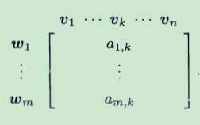

很多的线性代数的教材都是先引入行列式以及矩阵的额概念，然后通过矩阵和行列式来证明线性代数中一系列重要的结论。这样的讲解方式既让人难以理解，又缺少数学上的动机，学生很难理解为什么需要矩阵来说明，这背后的意义又是什么。

而《线性代数应该这样学》一书打破了常规的思路，先介绍我们比较容易理解的向量空间，然后以此进入抽象的线性算子的结构，思路连续，比较容易理解。

## 向量空间

* 向量空间的定义

  长度为n的组（Iist）是按照排序的、用逗号隔开的并且两端用括号括起来的n 个对象（这个对象可以是数、函数和更复杂的东西），n长度的组具有下面的形式：
  $$
  (x_1,x_2...x_n)
  $$
  $x_j,j=1,2,3...n$是上述组的第$j$个坐标。我们需要记住组的长度都是有限的。

  每一个坐标的所在的域都要是相同的，下面的说明我们都会使用$x_j \in F,j=1,2,3...n$ 来表达坐标元素所在的域（比如实数域R，复数域C）。

  这样的组表示的一定长度，有一定的方向的箭头表示的是一个向量（虽然在2维和3维中我们很容易想象出一个这样的箭头，但是更高维我们无能为力，我们也不需要时刻需要几何印象，这不是向量的本质）

  这样的组支持一些加法、标量乘法这样的操作。事实上这也是向量空间最基本的两种运算操作。

  我们定义：**向量空间**是带有加法和标量乘法的集合**V**。

  这样我们可以推导出一系列的性质：交换性、结合性、加法单元、加法逆、乘法单位元、分配性质等等。

* 向量空间的性质

  这些性质都是可以通过简洁的推导证明的，我们在这里就不一一证明了。

* 子空间

  V的子集U称为V的子空间，比如
  $$
  U = \{(x_1,x_2,0)|x_1,x_2 \in F\}\\
  $$
  U是向量空间$F^3$ 的一个子空间。

  要证明一个集合是否是另一个集合的子空间，只需要证明下面的性质（充分必要条件）：

  * 加法单位元**0** $\in U$
  * U对于加法封闭
  * U对于标量乘法封闭

  第一个条件保证了U这个空间存在加法单位元，第二个保证了加法在U上是有意义上的，第三个保证了乘法在U上有意义。

  子空间U虽然是V的一个子集，但是子空间具有很特殊的性质，并不是任意的子集，值得我们研究。

* 直和

  直和的定义：

  >向量空间V中的每一个向量都可以用V的一组子空间$U_1...U_n$ 通过下面的方式**唯一**表示，那么称$U_1...U_n$ 是V的一组直和。
  >
  >$v=u_1+u_2+...+u_n,u_j \in U_j$ 

  设一个向量空间V有子空间$U_1,U_2...U_n$，$U_1,U_2...U_n$ 是V的直和（用数学符号表示就是$V=U_1\oplus U_2...\oplus U_n$）当且仅当下面的条件成立：

  * $V=U_1+U_2+...U_n$
  * 若$0=u_1+u_2+...u_n,u_j\in U_j$，则每一个$u_j=0$。

## 有限维向量空间

在这一章中V表示的是F上的向量空间。

1. 张成的概念

   V中的一组向量的$(v_1,v_2...v_n)$ 的线性组合是下面的形式：
   $$
   a_1v_1+a_2v_2+a_3v_3+...a_nv_n\\
   其中 a_1,a_2...a_n \in F
   $$
   $(v_1,v_2...v_n)$ 所有的线性组合及称为$(v_1,v_2...v_n)$的张成，记作$span(v_1,v_2...v_n)$ 。

   我们可以想见V中任意一个向量组合的张成都是V的一个子空间，因为所有的向量加法运算和数乘运算最后都可以变成$(v_1,v_2...v_n)$ 的线性组合方式，即在张成内部是加法和数乘封闭的。

   >如果一个向量空间可以由他的一组向量张成，那么这个向量空间是有限的。

2. 线性无关

   如果一组向量$(v_1,v_2...v_n)$，使得$a_1v_1+a_2v_2+a_3v_3+...a_n v_n=0$ 的只有$a_1=a_2=...=a_n=0$， 那么称$(v_1,v_2...v_n)$ 是线性无关的。

3. 线性相关性引理

   如果$(v_1,v_2...v_n)$ 在V中是线性相关的，并且$v_1 \neq 0$，则有$j \in \{2,3...n\}$ 使得下面的成立

   (a) $v_j \in span(v_1,v_2...v_{j-1})$；

   (b) 如果从$(v_1,v_2...v_n)$ 中去掉第 $j$ 项，那么剩余的组张成等于$span(v_1,v_2...v_n)$.

   这个引理会经常用到，比如下面的这个结论证明就用到了该引理

   > 在有限维的向量空间中，线性无关组的长度一定小于或等于张成向量组的长度

   > 有限维的向量空间的子空间都是有限维的。

   上面的两个结论都是在我们的知识范围内可以证明的，感兴趣可以证明一下。

### 基

1. 定义：如果V中的一个向量组既是线性无关的，又能够张成V，那么这组向量组就是一组基。

   根据这个定义来证明一个向量是一个空间的基是最直接的。

2. V中的向量组$(v_1,v_2...v_n)$ 是V的基当且仅当V中的每一个向量都能表唯一示成下面的形式：
   $$
   v=a_1v_1+a_2v_2+a_3v_3+...a_n v_n
   $$

3. 向量空间中，每一个张成组都可以化简成一个基。

4. 在向量空间中，每一个线性无关组都可以扩充成一个基。

5. 设V是有限维的，U是V的一个子空间，那么一定一定存在V的一个子空间W使得$V=U \oplus W$.

6. 一个向量空间的所有基的长度都是一致的，这个长度称为该向量空间的维数。

7. 若V是有限维的，而且U是V的子空间，那么$dim U \leq dimV$

8. 如果V是有限维的，则V中每个长度为$dimV$ 的张成向量组都是V的基。

9. 如果V是有限维的，则V中每个长度为$dimV$ 的无关向量组都是V的基。

10. 如果U和W是同一个有限维向量空间的两个子空间，那么
  $$
  dim(U+W) = dim(U) + dim(W) - dim(U \cap W)
  $$

11. 设V是有限维的，并且$U_1,U_2...U_m$ 是V的子空间，使得
    $$
    V=U_1+U_2+...+U_m\\
    并且dim V = dim U_1 + ... + dim U_m\\
    则V=U_1 \oplus...\oplus U_m
    $$

## 线性映射

1. 定义：从向量空间V到W的线性映射是具有下面性质的函数$T: V \to W$

   T 符合加性和齐性两种特质

   加性：对于所有的$u,v \in V$，都有$T(u+v)=T(u)+T(v)$；

   齐性：对于所有的$u\in V, a \in F$，都有$T(u)=aT(u)$；

   从Ｖ到W的所有的线性变换的集合记为$L(V, W)$，下面我们看几个线性变换的例子

   #### 零

   $0v=0$,零吧V中所有的向量转换为W中的加法单位元

   #### 恒等

   这种函数记为 $I$ ，它把每个向量映射为自身，$I \in L(V,V)$

   #### 微分

   对于一个多项式空间，定义$T \in L(P(R), P(R))$，使得
   $$
   T(p) = p'
   $$

   #### 从$F^n$ 到$F^m$ 的映射

   定义$T \in L(R^3, R^2)$
   $$
   T(x,y,z)=(2x-3y+z, 7x+5y-2z)
   $$
   更一般的是m,n是正整数
   $$
   T(x_1,x_2...x_n) = (a_{11}x_1+..a_{1n}x_n...a_{m1}x_1+...a_{mn}x_n)
   $$
   每一个从$F^n$ 到$F^m$ 的映射都可以转化这种形式。

   还有其他的线性映射可以自己去了解。

2. 线性变换构成的向量空间

   前面定义向量空间的时候就有说过，向量空间元素可以任何的对象，也包括这里的映射函数,我们要使$L(V,W)$ 构成一个向量空间，要满足三个条件——有加法单位元0，加法封闭，数乘封闭。

   对于$S,T \in L(V, W)$，定义一个函数$S+T \in L(V,W)$ 
   $$
   (S+T)v = S(v) + T(v)
   $$
   我们要证明（S+T）的确是一个$V \to W$的映射。

   同理对于$T \in L(V, W)$，定义一个函数$ aT \in L(V,W)$ 
   $$
   (aT)v = a(Tv)
   $$
   我们要证明 $aT$ 的确是一个$V \to W$的映射。

3. 零空间和值域

   零空间：就是在 $V$ 中的一些向量，这些向量经过映射 $T$ 之后在W中得到的是加法单位元 $0$ 。这些向量组成的集合就是零空间，记为：$null\ T$
   $$
   null\ T = \{v \in V|Tv = 0\}
   $$
   具体的例子就是比如对于**微分**这个线性变换，只有对于常数的求导才是0，所以对弈微分这种线性变换来说$null\ T = {\ 常函数}$ 

   1. 若$T \in L(V,W)$，则$null\ T$ 是V的子空间

   这个结论可以根据子空间的充要条件来证明。

   2. 设 $T \in L(V,W)$， 则T是单射的当且仅当$null\ T=\{0\}$

      这结论很重要，单射的概念和函数中的一一映射是相同的，一个向量只对应一个向量。

   值域：V中的所有向量能够通过的T映射到的W中的所有向量的集合是值域，记为$range\ T$
   $$
   range\ T = \{Tv|\ v \in V\}
   $$

   1. 若$T \in L(V,W)$，那么$range\ T$ 是W的子空间

      这个结论是和零空间是V的子空间对应的，证明方法相同。

   2. 如果V是有限维向量空间，并且$T \in L(V,W)$ ，那么$range\ T$是W的有限维子空间，并且
      $$
      dim\ V = dim\ null\ T + dim\ range\ T
      $$
      证明思路，我们在前面已经知道，零空间是T的子空间，也就是零空间的维数小于T，设为n，而且可以从 $(v_1...v_n)$ 这个零空间的基中扩展出T的基$(v_1...v_n,w_1...w_m)$。那么只要证明$range\ T$ 维数是m。

      这个结论是本章的重点，它描述的是原向量空间和映射函数空间的关系

   3. 上面结论的推论：

      * 如果V和W都是有限维的向量空间，并且$dim\ V > dim\ W$，那么V到W的映射一定不是单射的。
      * 如果V和W都是有限维的向量空间，并且$dim\ V < dim\ W$，那么V到W的映射一定不是满射的。

      上面的两个结论可以从一个方面来解释线性方程组的解析解的个数问题。

      对于一个齐次方程组
      $$
      \sum_{k=1}^{n} a_{1k}x_k = 0\\
      \vdots\\
      \sum_{k=1}^{n} a_{mk}x_k = 0\\
      $$
      我们可以先行空间来理解，设方程组的n个变量看成是向量空间V中的一个向量$x=(x_1...x_n)$，映射关系T可以把这个向量映射到一个m维的空间中的一个向量
      $$
      T(x_1...x_n) = (\sum_{k=1}^{n} a_{1k}x_k,...,\sum_{k=1}^{n} a_{mk}x_k)
      $$
      齐次方程的解的问题就是这个映射的零空间的集合是否就是一个零向量而没有其他取值。

      如果是$n>m$ (变量多于方程数量)，映射不是单射的，说明方程必然有非零解。

### 线性映射的矩阵

我们看到如果 $(v_1...v_n)$ 是V的基，并且$T:T\to W$ 是线性的，那么 $Tv_1...Tv_n$ 确定了 T 在 V 中的任意向量上的值，矩阵就是用来有效的记录这些 $Tv_j$ 的值。

设 $T\in L(V,W),(v_1...v_n)$ 是 V 的基，$(w_1...w_m)$ 是 W的基，那么对于每一个$k=1,2...n,Tv_k$ 

都可以唯一写成这些 $w$ 的线性组合。
$$
Tv_k = a_{1k}w_1 + ...+a_{mk}w_m
$$
这样，只要确定 V 和 W 上的一组基，那么这个线性映射就可以通过这些 $a_{ij}$ 唯一确定，这个 $m \times n$ 的矩阵就用来表示一个线性映射的关系。而且一般对于一个空间来说，最常用的是他们的标准基。数学上把线性映射 T 在 基 $(v_1...v_n)$ 和 $(w_1...w_m)$ 上构造的矩阵记为
$$
M(T,  (v_1...v_n),(w_1...w_m))
$$
关于如何通过两组基构造一个线性映射的矩阵，可以这样想象：定义域的基向量放在矩阵的顶上，矩阵的一列就是值域的基向量对应的系数，可以用一组唯一的系数 $a_{1k}, a_{2k},...a_{mk}$ 来表示 V 空间的基向量在 W空间的映射值，一组这样的值就矩阵的一列。

* 矩阵的运算

  既然我们已经知道了矩阵可以表示一个线性映射，而且我们知道线性映射是可以进行一定的运算的，那么么很自然的线性映射对应的矩阵是不是还是符合线性运算呢？

  为了让矩阵的运算符合优雅的线性性质，我们定义矩阵的加法
  $$
  \pmatrix{
    a_{11} & \dots & a_{1n} \\
    \vdots & & \vdots \\
    a_{m1} & \dots & a_{mn}
  } +
  \pmatrix {
     b_{11} & \dots & b_{1n} \\
    \vdots & & \vdots \\
    b_{m1} & \dots & b_{mn}
  } = 
  \pmatrix{
      a_{11}+b_{11} & \dots & a_{1n}+b_{1n} \\
    \vdots & & \vdots \\
    a_{m1}+b_{m1} & \dots & a_{mn}+b_{mn}
  }
  $$
  对于这样的定义的矩阵加法，你可以换很轻松的证明当 $T,S \in L(T,W)$ 时
  $$
  M(T+S) = M(T) + M(S)
  $$
  同理我们可以定义矩阵的数乘（这里就不在写明了）。我们可以证明下面的性质
  $$
  M(cT) = cM(T)
  $$
  我们已经证明了矩阵的加法和数乘，由此以矩阵为元素的一个向量空间就出来了（还记得向量空间的定义吗）。

* 矩阵空间

  元素在 F 中的所有的 $m \times n$ 矩阵的集合记为 $Mat(m,n,F)$，可以验证 $Mat(m,n,F)$ 实向量空间（满足加法和数乘），加法单元是所有元素全都为 0 的$m \times n$ 矩阵。

* 矩阵乘法的意义

  矩阵的乘法需要进行定义，但是只是简单的对应相乘是没有实际意义的，那应该怎么样进行设计才是一个合理的矩阵乘法运算呢

  设 $T : V \to W,S : U \to V,(v_1...v_n)$ 是 V 的基，$(w_1...w_m)$ 是 W的基，$(u_1...u_m)$ 是 U 的基，它们的复合运算 $TS$ 是一个 $U \to W$ 的映射，怎么设计矩阵的乘法才能使得下面优雅的算式成立呢？
  $$
  M(TS) = M(T) M(S)\\
  M(T) = \pmatrix{
    a_{11} & \dots & a_{1n} \\
    \vdots & & \vdots \\
    a_{m1} & \dots & a_{mn}
  },
  M(S) = \pmatrix {
     b_{11} & \dots & b_{1p} \\
    \vdots & & \vdots \\
    b_{n1} & \dots & b_{np}
  }
  $$
  设计的过程我们可以根据前面矩阵的定义来说明，对于 $k\in \{1,2...p\}$ ，选取一个向量 $u_k$ 对该向量进行线性变换。复合拆分成两个线性变换来进行，就可以得到乘法的意义了。
  $$
  TSu_k = T(\sum_{r=1}^nb_{rk}v_r) \\
  =\sum_{r=1}^n(b_{rk}(Tv_r))\\
  \sum_{r=1}^n(b_{rk}\sum_{j=1}^m(a_{jr}w_j))\\
  \sum_{j=1}^m(\sum_{r=1}^na_{jr}b_{rk}) w_j
  $$
  可以知道$m\times n$ 和 $n\times p$ 矩阵相乘得到一个 $m \times p$ 的矩阵，它的第 $j$ 行第 $k$ 列元素等于$\sum_{r=1}^na_{jr}b_{rk}$ 。

  #### 向量的矩阵

  设$(v_1...v_n)$ 是 V 的基，如果 $v \in V$，那么存在一组数 $b_1,b_2,...b_n$， 使得
  $$
  v=b_1v_1+...+b_nv_n
  $$
  那么记 v 的矩阵是一个 $n \times 1$ 的矩阵，记为 $M(v)$ 写成下面的样子
  $$
  M(v) = \pmatrix {
    b_1 \\ \vdots \\ b_n 
  }
  $$

* 设 $T\in L(V,W),(v_1...v_n)$ 是 V 的基，$(w_1...w_m)$ 是 W的基，那么对于每个 $v\in V$ 都有
  $$
  M(Tv) = M(T)M(v)
  $$
  上面的命题也就是说明了线性变换用矩阵表示之后还是符合用线性变换表示的。

* 可逆性

  矩阵的运算是可逆的，正如线性变换是可逆的，但是这种可逆是要满足一定的条件的。

  定义可逆的说明

  > 线性映射 $T\in L(V,W)$ 称为可逆的，如果存在在线性映射 $S \in L(W,V)$，使得 ST等于V上面的恒等映射。满足 $ST=I,TS=I$ 的线性映射 $S \in L(V,W)$ 称为 T的逆。

  我们很容易证明一个线性映射的逆是唯一的（利用反证法和可逆的定义）。

* 可逆性的充分必要条件

  一个线性映射是可逆的当且仅当它是单射又是满射的。

  证明过程还是挺有趣的。

* 如果两个空间存在一个可逆的线性映射，那么两个空间具有相同的结构，数学上称为同构的。我们可以把这种可逆的线性映射（单射又是满射）看作是把空间中的所有点重新标记一遍。

* 两个同构的空间维数一定一样。

* 设 $T\in L(V,W),(v_1...v_n)$ 是 V 的基，$(w_1...w_m)$ 是 W的基，那么 $M$ 是 $L(V,W)$ 和$Mat(m,n,F)$ 之间的可逆线性映射。

  这个定理的意义就是说明矩阵和对应的线性映射有一种等价的关系（不知道严不严谨），而且现在我们可以确定一个线性映射的空间的维数怎么确定了。

* 如果 $V$ 和 $W$ 都是有限维的，那么 $L(V,W)$ 是有限维的，而且
  $$
  dim\ L(V,W) = (dim\ V)(dim\ W)
  $$
  因为我们可以确定矩阵空间的维数，一个 $m\times n$ 的矩阵可以分别让 $mn$ 个元素为零

* 一个向量空间到其自身的线性映射称为 **算子** ，用 $L(V)$ 表示在 V上所有的算子集合。我们从前面的推论可以知道，一个线性映射是否可逆可以通过其单射和满射的性质确定，但是对于 $L(V)$ 来说会不会更特殊呢，只需要单射或者满射就可以推知。

  >设V是有限维的，如果 $T \in L(V)$，那么下列等价
  >
  >（a）T是可逆的；
  >
  >（b）T 是单射的；
  >
  >（c）T 是满射的；

## 本征值和本征向量

1. 不变子空间

   我们知道了算子是从一个向量空间到自身的线性映射，设$T \in L(V)$ ，若果有直和分解
   $$
   V=U_1 \oplus U_2...\oplus U_n
   $$
   如果对于一个子空间 $U_j$ ，每个 $u \in U_j,Tu \in U_j$ ，我们说 U 在 T 下面是不变的。

   其中最简单平凡的一种不变子空间是一维不变子空间，一维子空间是很容易描述的
   $$
   任意 u \in V,U = \{au| a\in F\}
   $$
   那么算子在一维不变子空间中有社么性质呢？如果U 是一维不变子空间，很容易知道 $u \in U,Tu \in U$ 也就是存在 $\lambda \in F,Tu = \lambda u$。

   可以看到方程
   $$
   Tu = \lambda u
   $$
   的成立和一维不变子空间关系密切，我们把符合上面条件的 u 和 $\lambda$ 值称为征向量和特征值。

   上面的表达式等价于
   $$
   (T-\lambda I)u = 0
   $$
   如果把 $T-\lambda I$ 理解为一个新的线性映射，那么特征向量 u 的集合就是该映射的零空间 $null\  (T-\lambda I)$ 

2. **一个算子有特征值当且仅当定义域中存在非零的向量能被该算子映射成该向量的标量倍。**

3. 定理：若 $T \in L(V), \lambda_1,...\lambda_m$ 是 T 的互不相同的特征值， $(v_1...v_m)$ 是相应的非零特征值，则 $(v_1...v_m)$ 线性无关。

4. V 上的每个算子最多具有 $dim\ V $ 个互不相同的特征值

5. 多项式对于算子的作用

   算子比一般的线性映射理论要吩咐丰富吗因为算子可以进行多项式的幂操作。

   若 $T \in L(V)$ ，定义 $T^m = T...$ 并且 $T^0 = I$

   满足很多多项式的性质
   $$
   T^{m+n} = T^m T^n  \\
   (T^n)^m = T^{mn} \\
   定义一个多项式作用在算子上的效果 \\
   p(T) = a_0+a_1T+a_2T^2 + ...+a_nT^n\\
   那么(pq)(T) = p(T)q(T)
   $$

### 上三角矩阵

1. 有限维的非零向量空间上算子一定存在特征值。

   特征值的存在定理，不能确定有多少个特征值。

2. 算子的矩阵

   我们知道了一个线性映射需要确定两个空间的基才能确定它的矩阵，但是对于算子来说，映射发生在一个空间，只需要一个基就能确定它的矩阵。而且这是的矩阵一定是一个方阵。

   设 $T\in L(V)$ ，且 $(v_1...v_n)$ 是V的基，对于 $k = 1,...,n$ 都有
   $$
   Tv_k = a_{1k}v_1+...+a_{nk}v_n,a_{jk} \in F,j = 1,..n\\
   下面的 n \times n 举着称为 T关于基(v_1...v_n)的矩阵 \\
   \pmatrix{
     a_{11}& \dots & a_{an}  \\
     \vdots & & \vdots\\
     a_{n1} & \dots & a_{nn}
   }\\
   记为 M（T，(v_1...v_n)）
   $$
   线性代数的重要任务之一就是要证明存在一组基使得 $M(T)$ 很特殊，或者说含有很多的零。这里也就是要引出上三角矩阵，因为最后算子确实能够找到一个基得到一个上三角矩阵代表算子,。我们我马上就可以说明这个基是什么。先说明一下上三角矩阵
   $$
   \pmatrix{
     \lambda_1&& *  \\
    & \ddots\\
   0 & & \lambda_n
   }\\
   $$

3. 命题： 设 $T\in L(V)$ ，且 $(v_1...v_n)$ 是V的基，则下面的条件等价

   （a）T 关于基 $(v_1...v_n)$ 的矩阵是上三角的

   （b）$Tv_k \in span(v_1...v_k), k = 1,...n$ 

   （c）$span(v_1...v_n)$ 在 T 下是不变的， $k = 1,...,n$

   根据上三角矩阵特点和算子矩阵的定义就可以知道（a）（b）是等价的。而且（b）（c）的关系看起来更明朗一些，可以证明这两个命题的等价性。

4. 定理：若 V 是复向量空间，并且 $T\in L(V)$ 则T关于 V 的某个基具有上三角矩阵

   该定理证明了这个基的存在性，可以利用数学归纳法进行证明。注意这个定理在实空间是不成立的。自然我们会想到如何才能构造这个矩阵，后面我们会看到结果。

5. 假设 $T\in L(V)$ 关于 V的某个基具有上三角矩阵，则 T可逆当且仅当这个三角矩阵对角线上的元素都不是零。

6. 假设 $T\in L(V)$ 关于 V的某个基具有上三角矩阵，则这个上三角矩阵对角线上的元素恰好是 T的所有特征值。

### 对角矩阵

1. 对角矩阵的形式
   $$
   \pmatrix{
     \lambda_1&& 0  \\
    & \ddots\\
   0 & & \lambda_n
   }\\
   $$

2. 若 $T \in L(V)$ 有 $dim\ V$ 个互不相同的特征值，则 T关于V 的某个基具有对角矩阵。

3. 若 $T \in L(V)$ ，并且 $\lambda_1,...\lambda_m$ 是T 所有互不相同的特征值，则下面的命题等价

   （a）T 关于 B 的某个基有对角矩阵

   （b）V 有一个由T的特征向量组成的基

   （c）V 又在T 下不变的1维不变子空间 $U_1,...U_n$ ，使得
   $$
   V=U_1 \oplus U_2...\oplus U_n
   $$
   （d）$V = null(T-\lambda_1 I) \oplus ...\oplus null(T-\lambda_m I)$

   （e）$dim\ V = dim\ null(T-\lambda_1 I) \oplus ...\oplus dim\ null(T-\lambda_m I)$

## 内积空间

在$R^2$和$R^3$ 空间中我们把向量看作起始于原点的箭头，我们把向量 $x$ 的长度称为 $x$ 的范数